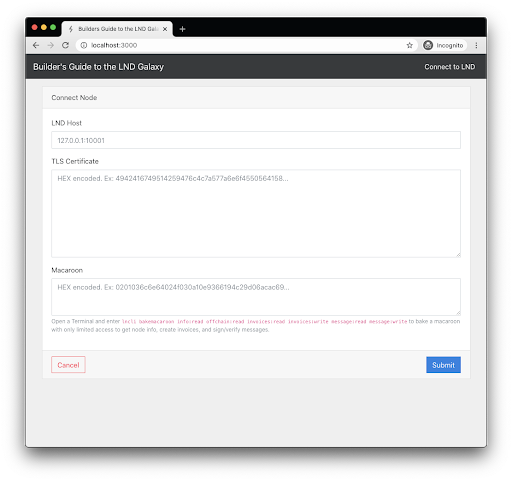
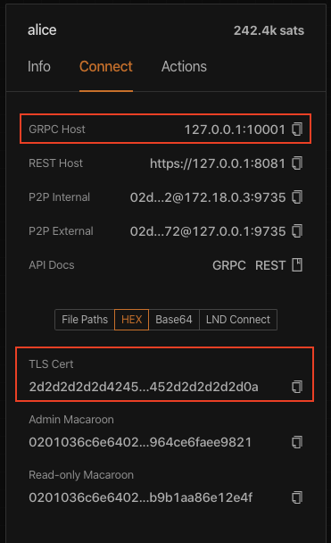
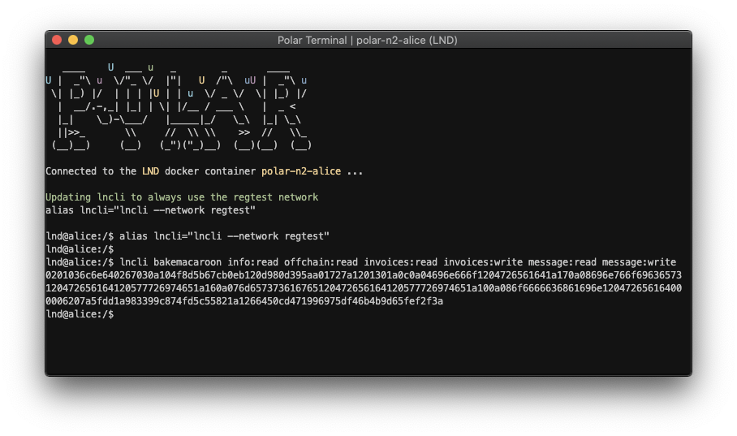

# Feature 1: Connect to LND

In order to send payments over the Lightning Network, we will need to communicate with a Lightning Node. In our case, we will be using `lnd` which is built and maintained by [Lightning Labs](https://lightning.engineering). The simplest way to create a local network is to use [Polar](https://lightningpolar.com), which you’ve hopefully already installed and played with. If not, go back and read the [Local Cluster Setup with Polar](../setup/local-cluster-setup-with-polar.md) section.

When connecting to an `lnd` node, there are 3 pieces of information that you will need:

1. **Node Hostname** - the IP address and port used to communicate with the node
2. **TLS Certificate** - `lnd` auto-generates a self-signed TLS certificate to secure communication of its GRPC and REST API’s. Consumers of the API need this in order to send & receive data with the node
3. **Macaroon** - these are like browser cookies on steroids. We won’t go into all the details here, since `lnd` will provide this to you. You can also “bake” macaroons using the `lncli` command line interface. We will make use of this later to limit how much control over the node we give to the backend server.  

We will collect these 3 pieces of information from a user in a new form on the frontend. Then, we will send this data to the backend where it will make a test connection to get the node’s info. If the connection fails, an error will be returned by the API and presented in the UI. If it succeeds, then the backend will store the connection info and return a unique token for this user. The token will be saved in the browser’s local storage and sent with all future API requests. This is how we can determine which browser client is associated with which node credentials we have stored in the database.

We want to store the connection info because we want our backend to interact with the user’s node even after they leave our website. Let’s walk through the use case. Alice comes to the website, connects to her node, then creates a post. She then walks away from her computer. Some time later, Bob visits the website. He reads Alice’s post and loves it. He wants to upvote it to pay her 100 sats. At this point, our app needs to create an invoice on Alice’s node and give that invoice to Bob so that he can pay it using his node. To get that invoice while Alice is away, we need to use her node’s connection info that we stored when she connected her node. With this architecture in place, Alice can continue stacking sats while she sleeps, thanks to the quality content she has posted on our site.

Let’s see what’s needed to implement this feature by checking out the `feat-1` branch. We’ll review the major changes that were made.

```text
git checkout feat-1
```

## Added backend class to connect to `lnd` and create tokens

We are going to take advantage of the existing NPM package [@radar/lnrpc](https://www.npmjs.com/package/@radar/lnrpc) to save us from writing a bunch of gRPC plumbing code to communicate with `lnd` nodes. We chose this one because it has Typescript types for all of `lnd`’s gRPC endpoints, that make the development experience a bit easier. There are a [few others](https://github.com/bcongdon/awesome-lightning-network#libraries) out there for different languages.

`source: /backend/node-manager.ts`

```typescript
async connect(host: string, cert: string, macaroon: string, prevToken?: string) {
   // generate a random token, without
   const token = prevToken || uuidv4().replace(/-/g, '');

   try {
     // add the connection to the cache
     const rpc = await createLnRpc({
       server: host,
       cert: Buffer.from(cert, 'hex').toString('utf-8'), // utf8 encoded certificate
       macaroon, // hex encoded macaroon
     });

     // verify we have permission get node info
     const { identityPubkey: pubkey } = await rpc.getInfo();

     // store this rpc connection in the in-memory list
     this._lndNodes[token] = rpc;

     // return this node's token for future requests
     return { token, pubkey };
   } catch (err) {
     // remove the connection from the cache since it is not valid
     if (this._lndNodes[token]) {
       delete this._lndNodes[token];
     }
     throw err;
   }
 }
```

We’ve created a new `NodeManager` class which will handle connecting to the `lnd` nodes.

The `connect()` function is responsible for validating the provided host, certificate, and macaroon. It uses the `createLnRpc()` function from the `@radar/lnrpc` npm package to establish a connection to the `lnd` node. It then calls the `rpc.getInfo()` function to return the node’s pubkey. The pubkey is a unique identifier for each Lightning node on the network.

If the connection is successful, it will store the rpc connection object into a map so that it can be later referenced in future API calls. It will then return an auto-generated unique token and the node’s pubkey. We will see how this is used in the next section. In a production application, you’d want to use something more secure, such as a [JWT](https://jwt.io/).

If the connection to the node fails for any reason, an error will be thrown and returned to the client.

## Stored the node’s info in the database to persist across server restarts

`source: /backend/posts-db.ts`

```typescript
private _data: DbData = {
   posts: [],
   nodes: [],
 };

.
.
.

 getAllNodes() {
   return this._data.nodes;
 }

 getNodeByPubkey(pubkey: string) {
   return this.getAllNodes().find(node => node.pubkey === pubkey);
 }

 getNodeByToken(token: string) {
   return this.getAllNodes().find(node => node.token === token);
 }

 async addNode(node: LndNode) {
   this._data.nodes = [
     // add new node
     node,
     // exclude existing nodes with the same server
     ...this._data.nodes.filter(n => n.host !== node.host),
   ];
   await this.persist();
 }
```

In order to persist the connection information for each node, we’ve added some fields and functions to our database class. We won’t go into too much detail here, since this is not directly related to the Lightning integration. The code should be pretty self-explanatory.

## Added API endpoint to connect to an `lnd` node and return a unique token

`source: /backend/routes.ts`

```typescript
private _data: DbData = {
   posts: [],
   nodes: [],
 };

.
.
.

 getAllNodes() {
   return this._data.nodes;
 }

 getNodeByPubkey(pubkey: string) {
   return this.getAllNodes().find(node => node.pubkey === pubkey);
 }

 getNodeByToken(token: string) {
   return this.getAllNodes().find(node => node.token === token);
 }

 async addNode(node: LndNode) {
   this._data.nodes = [
     // add new node
     node,
     // exclude existing nodes with the same server
     ...this._data.nodes.filter(n => n.host !== node.host),
   ];
   await this.persist();
 }
```

In order to persist the connection information for each node, we’ve added some fields and functions to our database class. We won’t go into too much detail here, since this is not directly related to the Lightning integration. The code should be pretty self-explanatory.

## Added API endpoint to connect to an lnd node and return a unique token

`source: /backend/routes.ts`

```typescript
/**
* POST /api/connect
*/
export const connect = async (req: Request, res: Response) => {
 const { host, cert, macaroon } = req.body;
 const { token, pubkey } = await nodeManager.connect(host, cert, macaroon);
 await db.addNode({ host, cert, macaroon, token, pubkey });
 res.send({ token });
};
```

`source: /backend/index.ts`

```typescript
app.post('/api/connect', catchAsyncErrors(routes.connect));
```

We’ve added a new API endpoint which the client will use to connect to their node. `connect()` will accept the host, certificate, and macaroon from the client. It will call `nodeManager.connect()` to validate the information is accurate. Then it will store this info along with the token and pubkey in our database for future reference. Finally, it will respond to the client with the `token` that was auto-generated by the `NodeManager`.

## Added **Connect to LND** screen on the frontend

We’ve updated a few files on the frontend to display a screen where the user can enter their node’s connection info, submit it to the backend, and store the provided token in the browser’s local storage for future requests.

We’ll go through each one starting from the api wrapper and work our way up to the React components.

`source: /src/lib/api.ts`

```typescript
export const connect = async (host: string, cert: string, macaroon: string) => {
 const request = { host, cert, macaroon };
 const { token } = await httpPost('connect', request);
 // save the token into the browser's storage
 setToken(token);
};
```

We added a `connect()` function to the api module which makes the http request to the backend with the host, cert, and macaroon. If the request doesn’t throw an error, the returned token is saved in the browser’s storage.

`source: /src/lib/api.ts`

```typescript
 const response = await fetch(url, {
   method: 'GET',
   headers: {
     'Content-Type': 'application/json',
     // add the token from localStorage into every request
     'X-Token': getToken(),
   },
 });
```

Also in the api module we updated the http `GET` and `POST` request helpers to include the token from storage with every http request.

`source: /src/store/store.ts`

```typescript
 connectToLnd = async (host: string, cert: string, macaroon: string) => {
   this.clearError();
   try {
     await api.connect(host, cert, macaroon);
     this.connected = true;
     this.gotoPosts();
   } catch (err) {
     this.error = err.message;
   }
 };

 disconnect = () => {
   api.clearToken();
   this.connected = false;
 };
```

In the mobx store, we’ve added two functions to connect and disconnect the client. `connectToLnd()` will attempt to make the API request to the backend, sending the host, cert and macaroon. If it succeeds, it will set the `connected` flag so that the frontend knows when it is connected to a node. It will also redirect the user to the screen that lists all posts. `disconnect()` will simply delete a saved token and set `connected` to false.

`source: /src/pages/Connect.tsx`

```jsx
 const handleSubmit = useCallback(
   async (e: React.FormEvent<HTMLElement>) => {
     e.preventDefault();
     store.connectToLnd(host, cert, macaroon);
   },
   [host, cert, macaroon, store]
 );
```

The newly added **Connect** component is mostly boilerplate React code. There are two things of interest in this file.

First, when the form is submitted, the `handleSubmit()` function will pass the host, cert and macaroon to the `store.connectToLnd()` function that we explained above. The store then gives it to the api wrapper which then makes the api request and stores the token.

Second, as you’ll notice in the screenshot below, we are asking the user to “bake” a macaroon for us.



Let’s dig into what baking a macaroon is and why we’d ever want to use it. By default, `lnd` will automatically generate three macaroons for your node:

* **readonly:** grants access to all RPC endpoints that do not modify the state of the node
* **invoice:** grants access to create and lookup invoices, but not read other data
* **admin:** grants full control over the node

As mentioned in the overview, we want our app to read some data \(info, balances, invoices, message verification\) as well as write some data \(invoices, message signing\). The **readonly** macaroon would not be sufficient for our needs because it cannot write data on the node. The **invoice** macaroon is also not useful because it cannot read the node’s info and balances. The **admin** macaroon would work but it has far too much privilege over the user’s node. We would be able to drain their onchain and offchain balances with this much privilege. It is far better for us to operate on a “Can’t be Evil” basis. Luckily, `lnd` allows us to bake custom macaroons with fine-grained permissions. These macaroons can be shared with third-parties and you can be assured that they cannot do more than you allow them to.

Visit the [Macaroons](https://github.com/lightningnetwork/lnd/blob/master/docs/macaroons.md) documentation in the `lnd` repo to read more on the permissions that can be granted when baking macaroons.

`source: /src/App.tsx`

```jsx
const pages: Record<string, ReactNode> = {
   posts: <PostList />,
   create: <CreatePost />,
   connect: <Connect />,
 };

.
.
.

 <Navbar.Toggle aria-controls="basic-navbar-nav" />
 <Navbar.Collapse id="basic-navbar-nav">
   <Nav className="ml-auto">
     <Nav.Item>
       {!store.connected ? (
         <NavLink onClick={store.gotoConnect}>Connect to LND</NavLink>
       ) : (
         <NavLink onClick={store.disconnect}>Disconnect</NavLink>
       )}
     </Nav.Item>
   </Nav>
 </Navbar.Collapse>
```

The final file we updated on the frontend was the App component. We add the **Connect** component to the **pages** mapping. We also conditionally display a **Connect to LND** link if the client is not connected or display a **Disconnect** link if it is connected.

## Connect your Polar node

Now let’s test the app to confirm we can connect the alice node in Polar to the website without any errors.



In Polar, click on the alice node, then in the sidebar click on the **Connect** tab, and finally click on the **HEX** option. Here you will see the **GRPC Host** and **TLS Certificate** which you can copy & paste into the web form. In order to get the custom macaroon with limited privileges we’ll need to take a few more steps.


Right click on the alice node, then click on the **Launch Terminal** option.



In the terminal window, copy and paste the following command and press Return:

`lncli bakemacaroon info:read offchain:read invoices:read invoices:write message:read message:write`

It will output a hex-encoded macaroon that only has the privileges listed above. Copy the macaroon into the web form and click the **Submit** button.


You should be redirected to the home screen and the link in the Navbar should say **Disconnect**. Feel free to test the failure case by providing an invalid host or macaroon.

We have now added the ability for our app to communicate with `lnd`. Next, we are going to use the token on the client to fetch the node’s alias and channel balance to display in the top Navbar.

