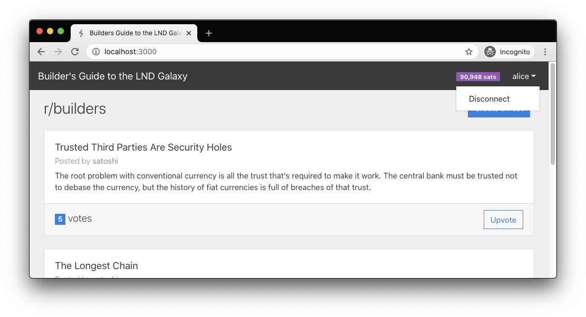

# Feature 2: Display Node Alias and Balance

The goal of this feature is pretty straight-forward. When a user connects their node to the site, we want them to be able to see their alias and channel balance, so that it is clear to them how much funds they have available to pay for upvotes.

To implement this feature, we first updated the backend to make this data available from our API. Then we updated the frontend to fetch this info from the backend.

Let’s go to the `feat-2` branch to see what’s changed.

```bash
git checkout feat-2
```

## Added API endpoint to return node alias and channel balance

To update our backend, we’ll need to add a new route to handle requests to fetch the node’s info.

`source: /backend/routes.ts`

```typescript
/**
* GET /api/info
*/
export const getInfo = async (req: Request, res: Response) => {
 const { token } = req.body;
 if (!token) throw new Error('Your node is not connected!');
 // find the node that's making the request
 const node = db.getNodeByToken(token);
 if (!node) throw new Error('Node not found with this token');

 // get the node's pubkey and alias
 const rpc = nodeManager.getRpc(node.token);
 const { alias, identityPubkey: pubkey } = await rpc.getInfo();
 const { balance } = await rpc.channelBalance();
 res.send({ alias, balance, pubkey });
};
```

In the `routes.ts` file, we added a new route handler function `getInfo()` which receives the user’s token, and first validates that it is valid. Then it uses the `NodeManager` class to get the RPC connection to the `lnd` node. With the rpc, we can not make two calls to lnd to fetch the alias and pubkey from getInfo\(\) and the balance from channelBalance\(\). Finally, we return this data to the client.

`source: /backend/index.ts`

```typescript
app.get('/api/info', catchAsyncErrors(routes.getInfo));
```

We updated the backend entrypoint file to instruct express to use the `getInfo()` route handler for `GET` requests to `/api/info`.

## Display node info in the UI

With the backend updated, we can now fetch the alias and balance from the backend to display in the UI. We’ll start with the api wrapper then work our way up to the UI.

`source: /src/lib/api.ts`

```typescript
export const getInfo = async () => {
 return await httpGet('info');
};
```

In the API wrapper module, we just added a function to make the http request and return the result.

`source: /src/store/store.ts`

```typescript
 init = async () => {
   // try to fetch the node's info on startup
   try {
     await this.fetchInfo();
     this.connected = true;
   } catch (err) {
     // don't display an error, just disconnect
     this.connected = false;
   }

   // fetch the posts from the backend
   try {
     this.posts = await api.fetchPosts();
   } catch (err) {
     this.error = err.message;
   }

   // connect to the backend WebSocket and listen for events
   const ws = api.getEventsSocket();
   ws.addEventListener('message', this.onSocketMessage);
 };

.
.
.

 fetchInfo = async () => {
   const info = await api.getInfo();
   this.alias = info.alias;
   this.balance = parseInt(info.balance);
   this.pubkey = info.pubkey;
 };
```

In the mobx store, we added the `fetchInfo()` function that will retrieve the `alias`, `pubkey` and `balance`, then update the app state with the returned values. We also updated the `init()` function to fetch the node info when the page first loads. If it succeeds, then we set the `connected` flag to true.

`source: /src/App.tsx`

```jsx
<Navbar.Collapse id="basic-navbar-nav">
 <Nav className="ml-auto">
   {!store.connected ? (
     <Nav.Item>
       <NavLink onClick={store.gotoConnect}>Connect to LND</NavLink>
     </Nav.Item>
   ) : (
     <>
       <Navbar.Text>
         <Badge variant="info" pill className="mr-3">
           {store.balance.toLocaleString()} sats
         </Badge>
       </Navbar.Text>
       <Dropdown id="basic-nav-dropdown" alignRight>
         <Dropdown.Toggle as={NavLink}>{store.alias}</Dropdown.Toggle>
         <Dropdown.Menu>
           <Dropdown.Item onClick={store.disconnect}>Disconnect</Dropdown.Item>
         </Dropdown.Menu>
       </Dropdown>
     </>
   )}
 </Nav>
</Navbar.Collapse>
```

Finally, we updated the App component to display the node’s alias and balance in the Navbar when it is connected. We also nested the **Disconnect** link under a dropdown menu.



If you go back to your browser, refresh the page and connect your node, you should now see the alias and balance at the top right of the screen.

This was a simple feature to implement, which was mostly plumbing code to get the data from `lnd`, through the backend, to the frontend, and finally displayed in the browser. The important takeaway here is that communicating with the Lightning Network is not very different from communicating with any other third-party APIs.

In the next feature, we’ll work on updating the Post creation process to add some Lightning functionality.

