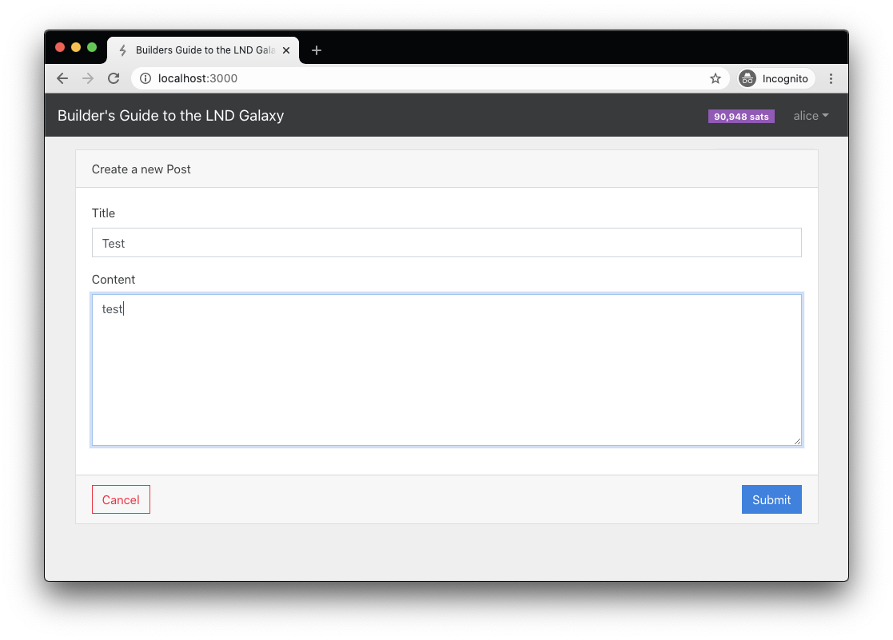
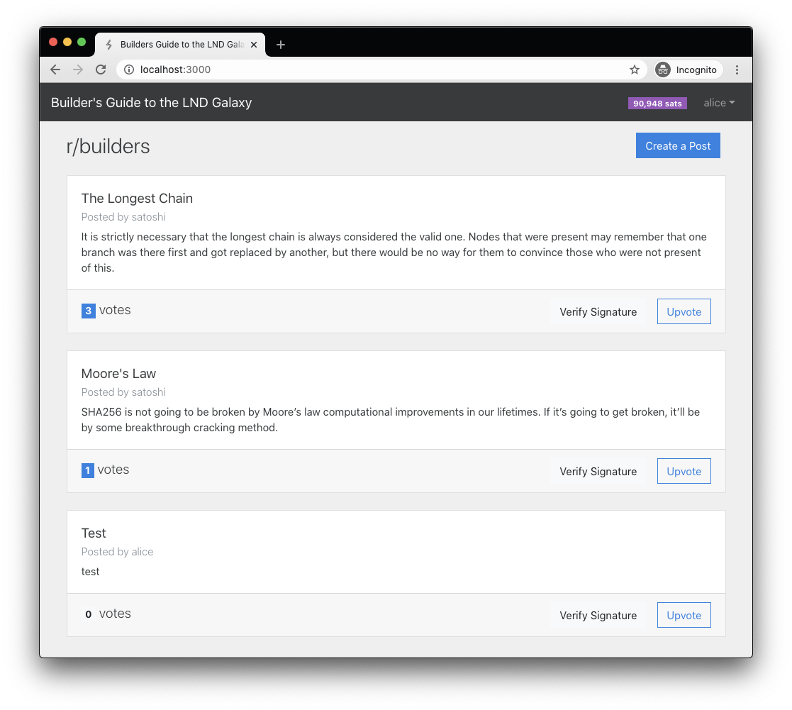
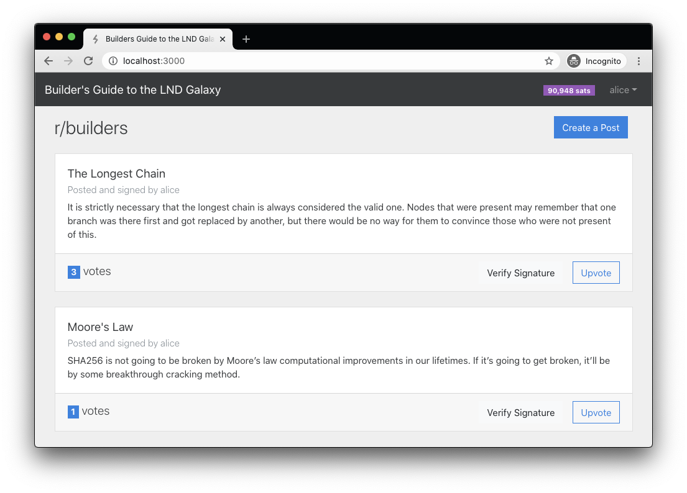
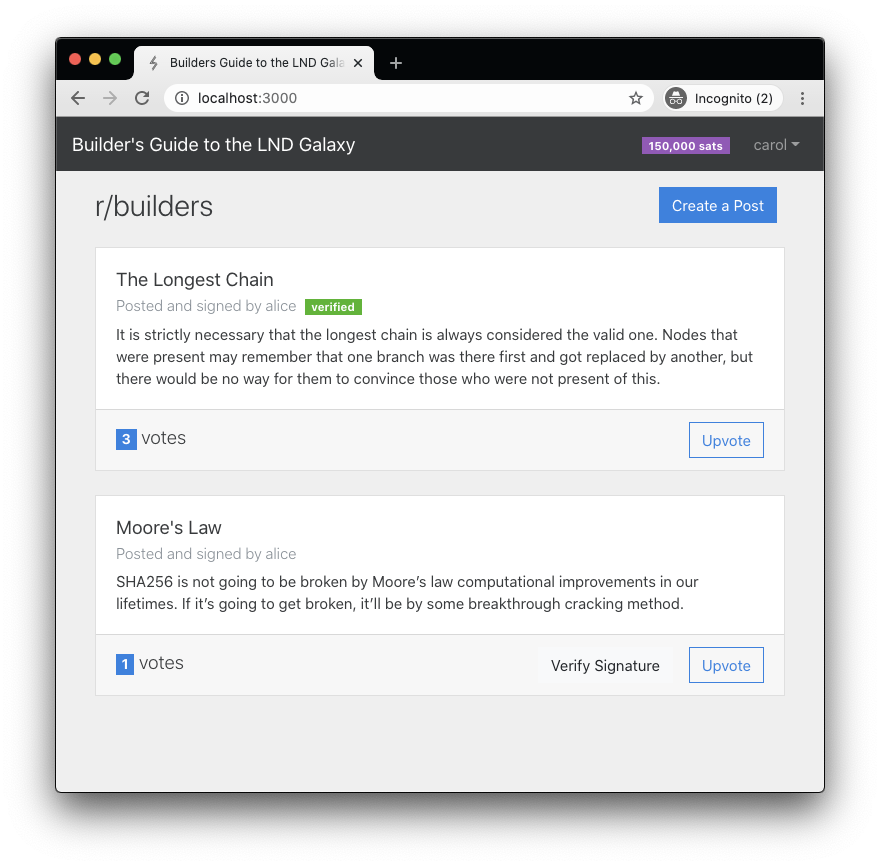

# Feature 3: Sign and Verify Posts

In this feature, we have introduced a couple new `lnd` endpoints, [SignMessage](https://api.lightning.community/#signmessage) and [VerifyMessage](https://api.lightning.community/#verifymessage). These can be useful in cases where one user wants to be certain that some content has not been altered by a third-party. Following our mantra of “Can’t Be Evil”, we want to ensure our users that we have not tampered with the posts they author. So when a user creates a post, we will sign the message using their node and store the `signature`. If another user wants to verify that the post has not been modified, they will verify the signature using their own node.

In addition to verifying signatures, we took this opportunity to remove the user-specified usernames for each post. Instead we use the node’s `alias` for this field.

Let’s go to the `feat-3a` branch to see what’s changed.

```text
git checkout feat-3a
```

## Replace username field with the node’s alias instead

To use the alias instead of a user-specified username, we needed to fetch the `alias` when the post is submitted to the backend and store it in the username field of the post. Then we need to remove the `username` field from the frontend flow that creates a post. As usual, we’ll start by updating the backend first then work our way up to the UI.

`source: /backend/routes.ts`

```typescript
export const createPost = async (req: Request, res: Response) => {
 const { token, title, content } = req.body;
 const rpc = nodeManager.getRpc(token);

 const { alias } = await rpc.getInfo();

 const post = await db.createPost(alias, title, content);
 res.status(201).send(post);
};
```

We updated the `createPost()` route handler to get the alias using `lnd`’s `getInfo()` endpoint. Then we pass the alias to the `db.createPost()` function instead of the username received from the client. Notice that we no longer take the `username` from `req.body` as we do not require the client to send this value anymore. Instead, this handler expects to receive the node’s `token`, which will be automatically provided after the user connects their node.

`source: /src/lib/api.ts`

```typescript
export const createPost = async (title: string, content: string) => {
 const request = { title, content };
 return await httpPost('posts', request);
};
```

On the frontend, we removed the `username` parameter in the API wrapper’s `createPost()` function since the backend no longer needs this info.

`source: /src/store/store.ts`

```typescript
 createPost = async (title: string, content: string) => {
   this.clearError();
   try {
     await api.createPost(title, content);
     this.gotoPosts();
   } catch (err) {
     this.error = err.message;
   }
 };
```

In the mobx store, we removed the `username` parameter as well.

`source: /src/pages/CreatepPost.tsx`

```jsx
const CreatePost: React.FC = () => {
 const store = useStore();

 const [title, setTitle] = useState('');
 const [content, setContent] = useState('');

 const handleSubmit = useCallback(
   async (e: React.FormEvent<HTMLElement>) => {
     e.preventDefault();
     store.createPost(title, content);
   },
   [title, content, store],
 );

 return (
   <Form onSubmit={handleSubmit}>
     <Card>
       <Card.Header>Create a new Post</Card.Header>
       <Card.Body>
         <Form.Group controlId="title">
           <Form.Label>Title</Form.Label>
           <Form.Control
             required
             value={title}
             onChange={e => setTitle(e.target.value)}
           />
         </Form.Group>
         <Form.Group controlId="title">
           <Form.Label>Content</Form.Label>
           <Form.Control
             required
             as="textarea"
             rows={8}
             value={content}
             onChange={e => setContent(e.target.value)}
           />
         </Form.Group>
       </Card.Body>
       <Card.Footer>
         <Row>
           <Col>
             <Button variant="outline-danger" onClick={store.gotoPosts}>
               Cancel
             </Button>
           </Col>
           <Col className="text-right">
             <Button variant="primary" type="submit">
               Submit
             </Button>
           </Col>
         </Row>
       </Card.Footer>
     </Card>
   </Form>
 );
};
```

Finally, in the `CreatePost` component, we removed the `username` state variable and associated field from the form.



Now when you visit the **Create a Post** screen in the browser, you will only see form fields to collect the Post’s title and content.



When you click submit, the new post will appear on the main screen with the subtitle “Posted by alice”. It set the username of the post to the alias of the node correctly.

## Sign the message content when the post is created

Using `lnd` to sign a message is pretty straightforward. We just need to call the [SignMessage](https://api.lightning.community/#signmessage) endpoint with the message content in a specific format.

Checkout the `feat-3b` branch to see what’s changed.

```text
git checkout feat-3b
```

`source: /src/shared/types.ts`

```typescript
export interface Post {
 id: number;
 title: string;
 content: string;
 username: string;
 votes: number;
 signature: string;
 pubkey: string;
}
```

We’ll need to add a couple more fields to our `Post` model to store the `signature` and the node’s `pubkey`. These values are needed when another user wants to confirm that the signature is valid.

`source: /backend/posts-db.ts`

```typescript
 async createPost(
   username: string,
   title: string,
   content: string,
   signature: string,
   pubkey: string,
 ) {
   // calculate the highest numeric id
   const maxId = Math.max(0, ...this._data.posts.map(p => p.id));

   const post: Post = {
     id: maxId + 1,
     title,
     content,
     username,
     votes: 0,
     signature,
     pubkey,
   };
   this._data.posts.push(post);

   await this.persist();
   this.emit(PostEvents.updated, post);
   return post;
 }
```

The `createPost()` function in the `PostsDb` class needed to be updated to add parameters for `signature` and `pubkey`, which are saved directly in the post.

**Note: since we are modifying the schema of the Post model, you should delete the /db.json file now. Any posts that were created without these new fields will cause the app to throw errors when we run it the next time.**

`source: /backend/routes.ts`

```typescript
export const createPost = async (req: Request, res: Response) => {
 const { token, title, content } = req.body;
 const rpc = nodeManager.getRpc(token);

 const { alias, identityPubkey: pubkey } = await rpc.getInfo();
 // lnd requires the message to sign to be base64 encoded
 const msg = Buffer.from(content).toString('base64');
 // sign the message to obtain a signature
 const { signature } = await rpc.signMessage({ msg });

 const post = await db.createPost(alias, title, content, signature, pubkey);
 res.status(201).send(post);
};
```

The final step on the backend is to update the `createPost()` route handler to sign the message using `lnd’s` [SignMessage](https://api.lightning.community/#signmessage) endpoint, then pass the `signature` and `pubkey` to the database to store for later.

`source: /db.json`

```javascript
 "posts": [
   {
     "id": 1,
     "title": "Moore's Law",
     "content": "SHA256 is not going to be broken by Moore’s law computational improvements in our lifetimes. If it’s going to get broken, it’ll be by some breakthrough cracking method.",
     "username": "alice",
     "votes": 2,
     "signature": "rn5h7rj497pryz8jmye5inqz4m1ykyg9e3js85a7zrbo9ugdh3bqo3zg8faam1tuxwdjupk4san8xayb5iqmc9jt1q7sni7hc6s1ce6b",
     "pubkey": "02dac3ee8de244753f50c6bc1ca5b51a0a71127061a995068115c723cef552aa72"
   }
 ],
```

Now if you create a new post, then open the `/db.json` file in your editor, you should see the new post listed with the pubkey and signature.

With these changes, the backend now supports signing all new posts when they are created. Our last step in this feature is to allow users to verify the signature using their node.

## Add button to verify a post’s signature

Verifying a `Post`’s signature is very similar to signing a message. We’ll just need to make use of `lnd`’s [VerifyMessage](https://api.lightning.community/#verifymessage) endpoint, giving it the post’s content and signature. It will return a `valid` flag set to `true` as well as the `pubkey` of the signing node which we can compare to the `pubkey` stored with the post record to confirm the signature is valid.

Checkout the `feat-3c` branch to see what’s changed.

```text
git checkout feat-3c
```

`source: /src/shared/types.ts`

```typescript
export interface Post {
 id: number;
 title: string;
 content: string;
 username: string;
 votes: number;
 signature: string;
 pubkey: string;
 verified: boolean;
}
```

We had to update the `Post` type to include a `verified` flag which will be `false` by default. We will switch it to `true` when another user verifies the content.

`source: /backend/posts-db.ts`

```typescript
 async verifyPost(postId: number) {
   const post = this._data.posts.find(p => p.id === postId);
   if (!post) {
     throw new Error('Post not found');
   }
   post.verified = true;
   await this.persist();
   this.emit(PostEvents.updated, post);
 }
```

Next, we’ve added a new `verifyPost()` function to the `PostsDb` class. This function just sets the `verified` flag to `true` for a specified post.

`source: /backend/index.ts`

```typescript
app.post('/api/posts/:id/verify', catchAsyncErrors(routes.verifyPost));
```

`source: /backend/routes.ts`

```typescript
/**
* POST /api/posts/:id/verify
*/
export const verifyPost = async (req: Request, res: Response) => {
 const { id } = req.params;
 const { token } = req.body;
 // find the post
 const post = db.getPostById(parseInt(id));
 if (!post) throw new Error('Post not found');
 // find the node that's verifying this post
 const verifyingNode = db.getNodeByToken(token);
 if (!verifyingNode) throw new Error('Your node not found. Try reconnecting.');

 if (post.pubkey === verifyingNode.pubkey)
   throw new Error('You cannot verify your own posts!');

 const rpc = nodeManager.getRpc(verifyingNode.token);
 const msg = Buffer.from(post.content).toString('base64');
 const { signature } = post;
 const { pubkey, valid } = await rpc.verifyMessage({ msg, signature });

 if (!valid || pubkey !== post.pubkey) {
   throw new Error('Verification failed! The signature is invalid.');
 }

 db.verifyPost(post.id);
 res.send(post);
};
```

In the `routes.ts` file we’ve added the `verifyPost()` route handler and mapped it to the url in `index.ts`. This is where the bulk of the logic for verification is. There is a bunch going on here so let’s walk through it step by step.

1. Get the `id` of the post from the url and the verifying user’s `token` from the request body
2. Find the post in the DB using the `id`
3. Find the node record using the `token` of the user performing the verification
4. We do not want to allow a user to verify their own posts, so we compare the `pubkey` of the node that signed this post with the `pubkey` of the verifying user’s node. If they are the same, we throw an error
5. With the basic validation done, now we can get the RPC connection of the verifying node and call the [VerifyMessage](https://api.lightning.community/#verifymessage) endpoint, passing it the base64 encoded message and the signature stored in the post record
6. The verifyMessage endpoint will return two values:
   1. `valid` is a boolean flag indicating if the signature is valid
   2. `pubkey` is the pubkey of the node that signed the message. It is recovered from the signature
7. To confirm the signature is valid, we must ensure that the `valid` flag is true and also that the response `pubkey` matches the pubkey of the node that created the post. It is possible that another node can sign this message and produce a valid signature, so we need to check both of these conditions.
8. Finally, if all of the verification checks pass, we call `verifyPost()` in the `PostsDb` class to set the post’s `verified` flag to true and return the updated post to the client

This completes all of the changes we need to make on the backend. Now let’s move to the frontend to implement verifying posts from the UI.

`source: /src/lib/api.ts`

```typescript
export const verifyPost = async (postId: number) => {
 return await httpPost(`posts/${postId}/verify`);
};
```

In our API wrapper module, we added the `verifyPost()` function to make the http request to the backend.

`source: /src/store/store.ts`

```typescript
 verifyPost = async (postId: number) => {
   this.clearError();
   try {
     const post = await api.verifyPost(postId);
     this._updatePost(post);
   } catch (err) {
     this.error = err.message;
   }
 };
```

In the mobx store, we added a new `verifyPost()` function which calls the API wrapper to make the http request, then updates the app state with the modified post record that is returned.

`source: /src/components/PostCard.tsx`

```jsx
const PostCard: React.FC<Props> = ({ post }) => {
 return (
   <Card key={post.id} className="my-4">
     <Card.Body>
       <Card.Title>
         <strong>{post.title}</strong>
       </Card.Title>
       <Card.Subtitle className="mb-2 text-muted">
         Posted
         {post.signature && ' and signed '}
         by {post.username}
         {post.verified && (
           <Badge pill variant="success" className="ml-2">
             verified
           </Badge>
         )}
       </Card.Subtitle>
       <Card.Text>{post.content}</Card.Text>
     </Card.Body>
     <Card.Footer className="d-flex justify-content-between">
       <h5 className="mt-1">
         <Badge variant={post.votes ? 'primary' : 'light'}>{post.votes}</Badge> votes
       </h5>
       <span>
         <VerifyButton post={post} />
         <VoteButton post={post} />
       </span>
     </Card.Footer>
   </Card>
 );
};
```

In the `PostCard` component, we’ve made a few updates for post verification:

* In the post’s subtitle, we display that the post was signed by the user if there is a `signature` present. 
* Also in the subtitle, it displays a badge with the text “verified” if the post’s `verified` flag is true.
* Next to the “Upvote” button we render a “Verify Signature” button. This is a new component that we’ll explain below.

`source: /src/components/VerifyButton.tsx`

```jsx
const VerifyButton: React.FC<Props> = ({ post }) => {
 const store = useStore();

 const handleVerify = useCallback(() => {
   store.verifyPost(post.id);
 }, [store, post.id]);

 if (post.verified) {
   return null;
 }

 return (
   <Button variant="light" className="mr-3" onClick={handleVerify}>
     Verify Signature
   </Button>
 );
};
```

We created a new `VerifyButton` component which is pretty simple. If the post is not verified, it renders a button on the screen. When the button is clicked, it calls the `store.verifyPost()` function to initiate the signature verification.



Refresh the page in your browser and create a couple posts. You will now see the updates we’ve made. The post subtitles display that the posts are signed and there is a “Verify Signature” button. If you click on the button, you will receive an error message stating _“You cannot verify your own posts!”_. This is the intended behavior as we do not want to allow users to verify their own posts.



To test the Verify Signature feature, you’ll need to disconnect and reconnect using a different node, such as carol. Then you’ll be able to click on the “Verify Signature” button and see the “verified” badge now displayed.

We have now completed this feature. Next, we are going to take on our biggest improvement. We’ll implement making payments over Lightning in order to upvote a post.

