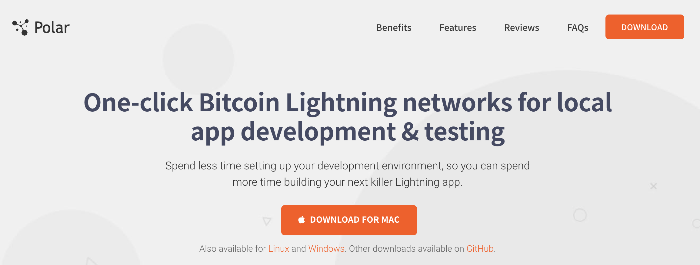

# Local Cluster Setup with Polar

## Install Polar

This tutorial will leverage the Polar application for setting up a local cluster of Lightning Network nodes on regtest. Polar [can be downloaded](lightningpolar.com) for MacOS, Linux, and Windows. The source code is hosted [on Github](https://github.com/jamaljsr/polar/releases/).

Mac and Windows users will need to install [Docker Desktop](https://www.docker.com/products/docker-desktop) as a dependency before using Polar. Linux users will need to download both [Docker Server](https://docs.docker.com/get-docker/) and [Docker Compose](https://docs.docker.com/compose/install/).

## Core UI Components

After downloading, installing, and running Polar, the following welcome screen will appear.

There are three options for users in the top right:
1. *Create Network*: spin up a new cluster of LND, c-lightning, eclair, and bitcoind nodes. This will create a Docker container within which Polar will operate.
2. *Import Network*: download a pre-built cluster of Lightning nodes for local testing.
3. *Manage Images*: customize the command used to start various versions of LND, c-lightning, eclair, and bitcoind nodes.

This tutorial will first focus on *Create Network*, so click either the orange “Create a Lightning Network” button in the middle, or *Create Network* in the top right corner.
