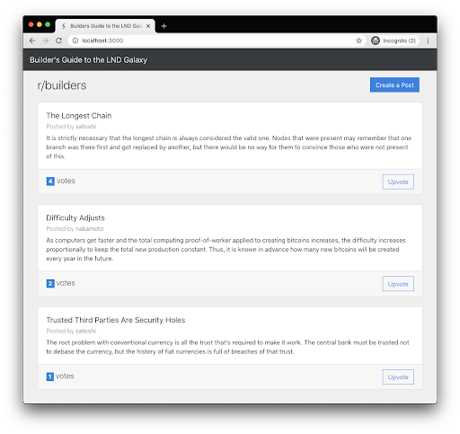
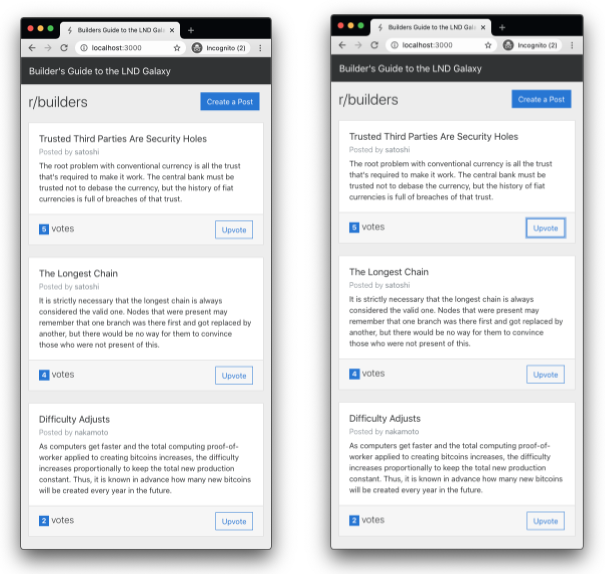

# Run the App Without LND Integration

Before we begin adding Lightning Network integration, let’s first get the app running on your computer.

Checkout the initial-app branch and start the app:

```
git checkout initial-app
yarn dev
```
Open your browser to [http://localhost:3000](http://localhost:3000) if it doesn’t open automatically.

## Walkthrough

If all went well with your development environment setup, you should see the initial screen below:


Click on the **Create a Post** button to go to the Create screen.


Fill in some info for the *Username*, *Title*, and *Content* fields, then click on the **Submit** button. You will be redirected back to the screen displaying the list of posts.


Add a couple more posts, just to have some data to play with.


Click on the **Upvote** button on a post to see the votes counter increment and the posts reorder based on which has the highest votes.



The app makes use of WebSockets to update the UI in real-time when posts are created and upvoted on the backend. To see this in action, open a second browser window side-by-side with the first window. Create a new post on the left to see it automatically appear on the right. Upvote a post on the right to see it increment and reorder on the left automatically.



## Architecture

This application is split into two parts, the backend API server and the frontend browser-based UI.


### Backend API

The backend API server stores the posts data in a centralized location for multiple clients to query. It is built using the [NodeJS](https://nodejs.org) platform for code execution and [expressjs](https://expressjs.com) web framework to handle API routing of requests and responses. 

The backend does not use a traditional database to try to keep the sample application simple. Instead, it keeps all of the posts & nodes data in memory while the server is running. It also persists the data to a JSON file in plain text on disk whenever it’s modified. This was done to make development easier. The backend server will need to restart often when making code changes and we would lose all of our data after each restart. **In a real world application, you should use a production level database.**

The structure of the files in the **backend** folder are:

```
backend/
├── index.ts        # main app entrypoint which starts the express API server
├── posts-db.ts     # class to hold the in-memory database
├── routes.ts       # route handlers for the API endpoints
└── tsconfig.json   # Typescript configuration file
```
### Frontend Web Client

The frontend web client displays the posts in a browser-based UI to allow users to interact with the app. It is built using [ReactJS](https://reactjs.org) for rendering the HTML views and [mobx](https://mobx.js.org) for client state management. 

The data flow in the frontend uses a layered approach to maintain a separation of concerns and make it easier to reason about. All of the application logic is done in the mobx store. Only it can make use of the API Wrapper functions. The React components are kept very light weight with just the forms containing local component state for input fields. 

The structure of the files in the **src** folder are:

```
src/
├── App.tsx             # top level component which renders the active page
├── components          # lower-level reusable components
│   ├── PostCard.tsx
│   └── VoteButton.tsx
├── index.css           # global CSS stylesheet
├── index.tsx           # entrypoint to render the client App
├── lib
│   └── api.ts          # wrapper functions to send/receive data to the backend API
├── pages               
│   ├── CreatePost.tsx  # the page to display the ‘Create a Post’ form
│   └── PostList.tsx    # the page that shows the list of posts
├── shared
│   └── types.ts        # shared types between the frontend and backend
└── store
   ├── Provider.tsx     # boilerplate to connect mobx to the components
   └── store.ts         # the mobx store to manage all application state
```
Now that you have a basic understanding of the initial application that we are working with, let’s start adding some Lightning Network functionality to our app.