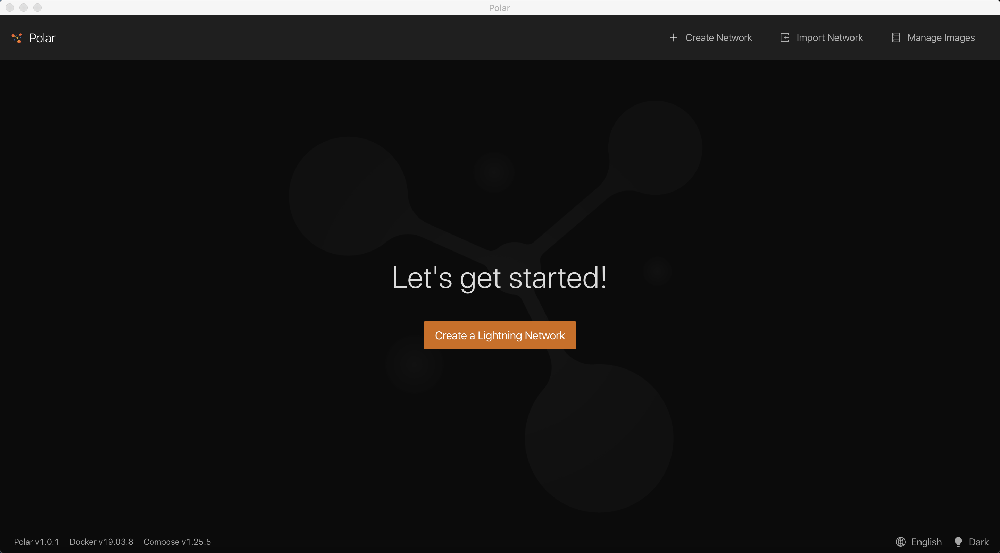
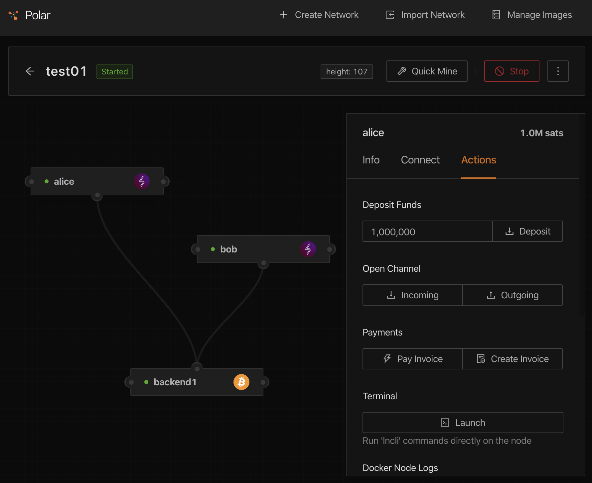
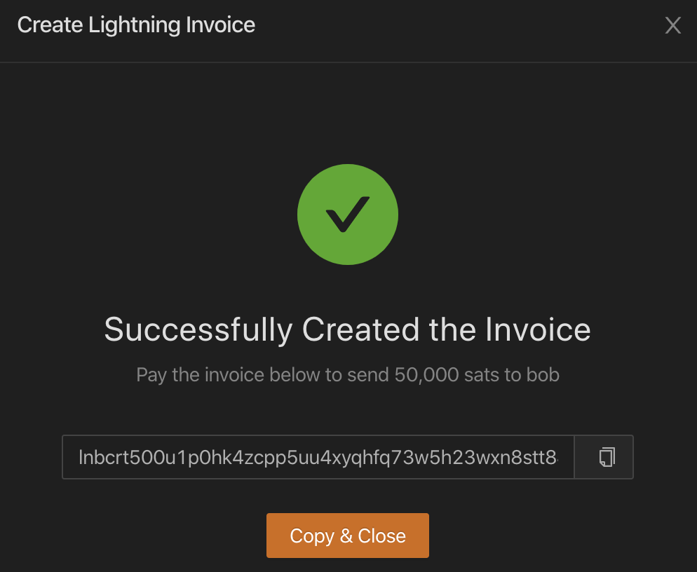
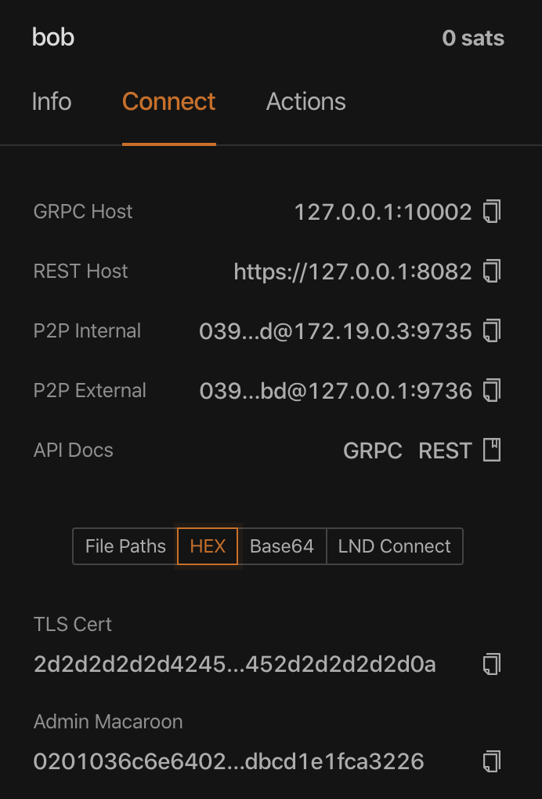

# Setup: Local Cluster with Polar

## Install Polar

This tutorial will leverage the Polar application for setting up a local cluster of Lightning Network nodes on regtest. Polar [can be downloaded](https://lightningpolar.com) for MacOS, Linux, and Windows. The source code is hosted [on Github](https://github.com/jamaljsr/polar/releases/).

Mac and Windows users will need to install [Docker Desktop](https://www.docker.com/products/docker-desktop) as a dependency before using Polar. Linux users will need to download both [Docker Server](https://docs.docker.com/get-docker/) and [Docker Compose](https://docs.docker.com/compose/install/).

## Core UI Components

After downloading, installing, and running Polar, the following welcome screen will appear.

There are three options for users in the top right:

1. _Create Network_: spin up a new cluster of LND, c-lightning, eclair, and bitcoind nodes. This will create a Docker container within which Polar will operate.
2. _Import Network_: download a pre-built cluster of Lightning nodes for local testing.
3. _Manage Images_: customize the command used to start various versions of LND, c-lightning, eclair, and bitcoind nodes.

This tutorial will first focus on _Create Network_, so click either the orange “Create a Lightning Network” button in the middle, or _Create Network_ in the top right corner.

## Create and Start a Network

After clicking _Create Network_, the following screen should appear. As previously mentioned, it allows you to specify how many of each node implementations your cluster will be composed of.

_Note_: You will always need at least one Bitcoin Core node!

Create a new Lightning Network with the following parameters:

* Network Name = test01 
* How many Managed Nodes?
  * LND = 2
  * c-lightning = 0
  * Eclair = 0
  * Bitcoin Core = 1

After clicking the orange Create Network button, Polar should display this new interface.

Press the orange **Start** button in the top right corner to start your local network. It takes a couple seconds for the nodes to boot up, but the indicator lights will eventually turn green signaling that the process has completed. Once this has happened, click on “alice” the `lnd` node to see the below screen.

Most of the information on this screen is self-explanatory. The local regtest instance is only at **Block Height** = 1 so alice’s **Confirmed Balance** and **Unconfirmed Balance** are both 0 sats. To change that, click on the **Actions** tab for alice, ensure **Deposit Funds** is set to 1,000,000 and press **Deposit**.

Two numbers should have changed after clicking **Deposit**. First, the height number in the top status bar incremented from 1 to 107. That is because it takes 100 blocks for a coinbase reward to become spendable by a `bitcoind` node \(if you click on backend1, you’ll see a **Spendable Balance** of &gt;349 BTC and an **Immature Balance** of &gt;5000 BTC\), and an additional 6 blocks for a deposit to `lnd` to be confirmed. Second, alice’s balance in the top right of her node panel increased from 0 to 1.0M sats, signifying the successful deposit.

## Create and Pay an Invoice

Now that alice’s on-chain wallet has been funded, it’s time to open a channel. Click **Open Channel -&gt; Outgoing**, select bob as the **Destination**, accept the default **Capacity \(sats\)** of 250,000, and click the orange **Open Channel** button.

Once the channel has been opened, click on the new green line between alice and bob’s `lnd` nodes to see the below screen.

Hovering over the green dot on alice’s node will display “Source”, while hovering over the blue dot on bob’s node will display “Destination”. This is to signify which side of the channel has the **Source Balance** of 240,950 sats, and which side has the **Destination Balance** of 0 sats.

Since bob has no **Destination Balance**, right click on his node open an Actions panel, and select **Create Invoice**. Accept the default 50,000 sat **Amount**, and press the orange **Create Invoice** button. Successfully doing so should create this screen.

Click on **Copy & Close**, right click on alice’s node, and select **Pay Invoice**. Paste the invoice you copied from the above screen into the **Bolt 11 Invoice** field, and click the orange **Pay Invoice** button. After doing so, the alice, bob, and channel dashboards should look like this:

Congratulations! You’ve made your first successful Lightning Network payment on regtest!

Before moving on, click on bob’s `lnd` node and over to his **Connect** dashboard. The url:port information for bob’s **GRPC Host**, **REST Host**, **P2P Internal**, and **P2P External** will be useful in the next section, as will the Hex details of bob’s **TLS Cert** and **Admin Macaroon**.

Now, click the red **Stop** button in the top right corner and prepare for the next section.

