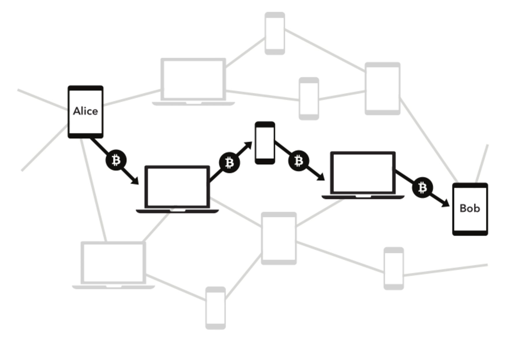

# Overview

This Conceptual Overview aims to provide _just_ enough information about `lnd` to enable readers to build applications. It starts with a conceptual review of the Lightning Network, before jumping into the important aspects of working specifically with `lnd`. If you are already comfortable with how the Lightning Network works, feel free to skip down to the [Components](components.md) section.

This overview assumes basic knowledge of Bitcoin mechanics. If terms like “UTXO” and “locktime” are unfamiliar to you, you should refer to the [Bitcoin developer guide](https://bitcoin.org/en/developer-guide), which serves a similar purpose.

