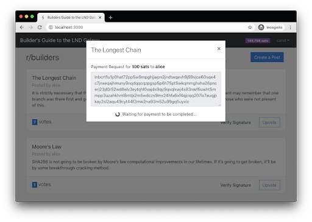
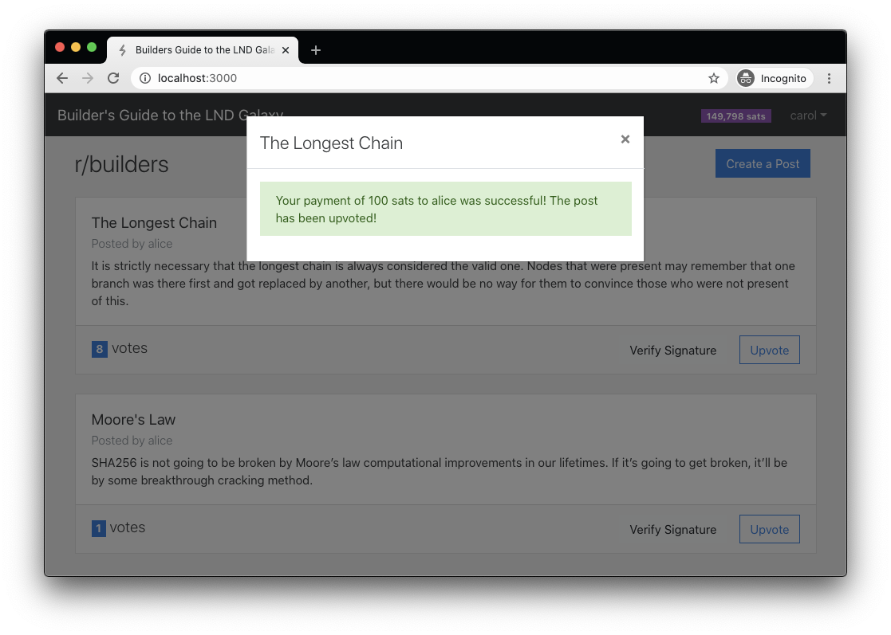
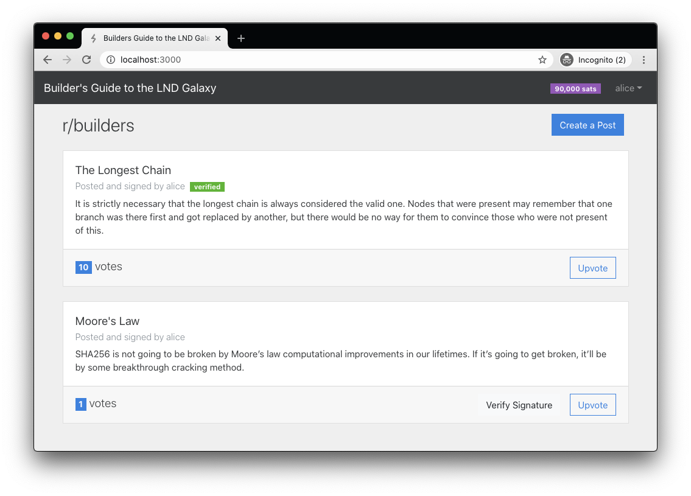

# Feature 4: Modify Upvote Action

Currently in our app, when a user clicks the Upvote button, we immediately make the API request to the backend to increment the number of votes for the post. We want to change that behavior to require the user to make a payment of 100 satoshis \(0.00000100 BTC\) to the post’s author before the upvote is submitted. Since we want the payment to go directly to the node of the user that created the post, we will need perform a few steps when the Upvote button is clicked:

1. Create a new invoice on the post author’s node
2. Present the invoice’s payment request string to the user performing the upvote
3. Wait for the user to pay the invoice over the Lightning Network
4. Once the invoice is paid, we’ll proceed with submitting the upvote to the backend
5. Finally, we’ll have a bit of fun by making it rain confetti on the post’s author’s screen

Let’s go to the `feat-4a` branch to see how we can implement this feature.

```text
git checkout feat-4a
```

## Request an invoice from the post author’s node

In order to make a standard payment on Lightning, the recipient must first create an invoice. To do this in our app, we created a new API endpoint on the backend.

`source: /backend/index.ts`

```typescript
app.post('/api/posts/:id/invoice', catchAsyncErrors(routes.postInvoice));
```

`source: /backend/routes.ts`

```typescript
/**
* POST /api/posts/:id/invoice
*/
export const postInvoice = async (req: Request, res: Response) => {
 const { id } = req.params;
 // find the post
 const post = db.getPostById(parseInt(id));
 if (!post) throw new Error('Post not found');
 // find the node that made this post
 const node = db.getNodeByPubkey(post.pubkey);
 if (!node) throw new Error('Node not found for this post');

 // create an invoice on the poster's node
 const rpc = nodeManager.getRpc(node.token);
 const amount = 100;
 const inv = await rpc.addInvoice({ value: amount.toString() });
 res.send({
   payreq: inv.paymentRequest,
   hash: (inv.rHash as Buffer).toString('base64'),
   amount,
 });
};
```

We added a new API route handler called `postInvoice()` which will receive the post’s `id` from the url. It then gets the full post object from the database in order to get the node that should receive the payment. We use the `pubkey` stored in the post to retrieve the node’s connection information from our database. Next, it calls the [AddInvoice](https://api.lightning.community/#addinvoice) `lnd` endpoint to create a new invoice for 100 sats. Once the invoice is created, we send the generated payment request and the invoice `hash` back to the client. The `hash` is what is used to uniquely identify this invoice on the node. We’ll need this later to check if the invoice is paid.

These are all the changes we needed on the backend for now. Let’s move on to the frontend.

`source: /src/lib/api.ts`

```typescript
export const createInvoice = async (postId: number) => {
 return await httpPost(`posts/${postId}/invoice`);
};
```

We added a `createInvoice()` function to the API wrapper on the frontend which is used to make the http request to the backend.

`source: /src/store/store.ts`

```typescript
 // PayModal state
 showPayModal = false;          // show the payment request modal dialog
 pmtForPost: Post | undefined;  // reference to the post that is being upvoted
 pmtAmount = '';                // the amount of the payment
 pmtRequest = '';               // the invoice’s payment request string
 pmtHash = '';                  // the hash (or id) of the payment from lnd
 pmtSuccessMsg = '';            // message to display after payment is complete
 pmtError = '';                 // message to display if the payment fails
```

In the mobx store, we need to maintain some application state that will be used for the upvote process.

`source: /src/store/store.ts`

```typescript
 showPaymentRequest = async (post: Post) => {
   this.clearError();
   try {
     const res = await api.createInvoice(post.id);
     this.pmtForPost = post;
     this.pmtAmount = res.amount;
     this.pmtRequest = res.payreq;
     this.pmtHash = res.hash;
     this.pmtSuccessMsg = '';
     this.pmtError = '';
     this.showPayModal = true;
   } catch (err) {
     this.error = err.message;
   }
 };

 hidePaymentRequest = () => {
   this.pmtForPost = undefined;
   this.pmtAmount = '';
   this.pmtRequest = '';
   this.pmtHash = '';
   this.pmtSuccessMsg = '';
   this.pmtError = '';
   this.showPayModal = false;
 };
```

Also in the store, we added two functions which we will call when we want to show or hide the payment request modal dialog.

The most interesting is `showPaymentRequest()` which accepts a post object. It makes the API request to the backend to create the invoice, then sets the state variables with the data returned in the API response. It also sets `showPayModal` to `true` in order to display the payment request on screen. We’ll discuss `pmtSuccessMsg` and `pmtError` a little later.

The `hidePaymentRequest()` function is straight-forward. It just resets the state variables and sets `showPayModal` to `false` to hide the payment request screen.

`source: /src/pages/PostList.tsx`

```jsx
{store.showPayModal && <PayModal />}
```

We just added one line to the `PostList` component to display a newly added `PayModal` component, which is shown below.

`source: /src/components/PayModal.tsx`

```jsx
const PayModal: React.FC = () => {
 const store = useStore();

 const body = !store.pmtSuccessMsg ? (
   <>
     <Form.Group controlId="title">
       {store.pmtError && <Alert variant="danger">{store.pmtError}</Alert>}
       <Form.Label>
         Payment Request for <strong>{store.pmtAmount} sats</strong> to{' '}
         <strong>{store.pmtForPost?.username}</strong>
       </Form.Label>
       <Form.Control
         required
         as="textarea"
         rows={5}
         value={store.pmtRequest}
         readOnly
       />
       <Form.Text></Form.Text>
     </Form.Group>
     <div className="text-center">
       <Spinner animation="border" size="sm" className="mr-2" />
       Waiting for payment to be completed...
     </div>
   </>
 ) : (
   <Alert variant="success">{store.pmtSuccessMsg}</Alert>
 );

 return (
   <Modal show={true} onHide={store.hidePaymentRequest}>
     <Modal.Header closeButton>
       <Modal.Title>{store.pmtForPost?.title}</Modal.Title>
     </Modal.Header>
     <Modal.Body>{body}</Modal.Body>
   </Modal>
 );
};
```

We added a new component called `PayModal`. This component will be displayed when `store.showPayModal` is true. It overlays the full screen displaying a textbox containing the invoice’s payment request and a message informing the user that we are waiting on them to send the payment. If `pmtSuccessMsg` has a value then the message will be displayed instead of the payment request.

`source: /src/components/VoteButton.tsx`

```jsx
 // create an invoice and show the modal when the button is clicked
 const handleUpvoteClick = useCallback(async () => {
   await store.showPaymentRequest(post);
 }, [store, post]);
```

The final change we made on the frontend is to the `VoteButton` component. When the “Upvote” button is clicked, we call the `showPaymentRequest()` function on the store instead of the `upvotePost()` function. This way, we collect the payment before submitting the upvote.

With these changes made, we can test the functionality in the browser.



Now when you click on the “Upvote” button for a post, you should see a modal dialog popup like above.

In the next section we’ll go over how to respond in our app when the payment is made over the Lightning Network.

## After payment, proceed with the upvote

Now that we have shown the payment request to the user, they can pay the invoice directly over the Lightning Network using their node. In your local environment, you can right-click on the carol node and click the “Pay Invoice” option. Paste in the payment request and click the “Pay Invoice” button. You should see the payment succeed, but our app still says “Waiting for payment…”. In this section, we’ll see how to get the app to listen for incoming payments and perform some action when this happens.

Checkout the `feat-4b` branch to view the new changes to the code.

```text
git checkout feat-4b
```

As usual, let’s start with the backend updates first.

`source: /backend/routes.ts`

```typescript
/**
* POST /api/posts/:id/upvote
*/
export const upvotePost = async (req: Request, res: Response) => {
 const { id } = req.params;
 const { hash } = req.body;

 // validate that a invoice hash was provided
 if (!hash) throw new Error('hash is required');
 // find the post
 const post = db.getPostById(parseInt(id));
 if (!post) throw new Error('Post not found');
 // find the node that made this post
 const node = db.getNodeByPubkey(post.pubkey);
 if (!node) throw new Error('Node not found for this post');

 const rpc = nodeManager.getRpc(node.token);
 const rHash = Buffer.from(hash, 'base64');
 const { settled } = await rpc.lookupInvoice({ rHash });
 if (!settled) {
   throw new Error('The payment has not been paid yet!');
 }

 db.upvotePost(post.id);
 res.send(post);
};
```

We updated the `upvotePost()` route handler to now require the invoice `hash` in the request. This change was made because we do not want to allow the user to upvote a post unless we can verify that the invoice identified by the `hash` has been paid already. We use `lnd`’s [LookupInvoice](https://api.lightning.community/#lookupinvoice) endpoint to find the invoice using the `hash`. The returned invoice has a `settled` flag indicating if it has been paid. If it is not paid then we throw an error. Otherwise, we continue to increment the number of votes.

_Note: there is vulnerability in our sample app here. A crafty user can make one payment and repeatedly upvote using the same `hash` over and over again. This can be fixed by storing a list of previously used invoice hashes in our database, then preventing them from being used more than once. We’ll leave fixing this as an exercise for the reader._

`source: /backend/node-manager.ts`

```typescript
 /**
  * listen for payments made to the node. When a payment is settled, emit
  * the `invoicePaid` event to notify listeners of the NodeManager
  */
 listenForPayments(rpc: LnRpc, pubkey: string) {
   const stream = rpc.subscribeInvoices();
   stream.on('data', invoice => {
     if (invoice.settled) {
       const hash = (invoice.rHash as Buffer).toString('base64');
       const amount = invoice.amtPaidSat;
       this.emit(NodeEvents.invoicePaid, { hash, amount, pubkey });
     }
   });
 }
```

In the `NodeManager` class, we’ve added a `listenForPayments` function. This showcases a powerful feature of `lnd`, streaming API endpoints. There are some API endpoints that return a stream of responses instead of a single response. When you subscribe to these streams, the app will hold a connection open to the node and will periodically receive data as events occur in `lnd`. In our case here, we are using the [SubscribeInvoices](https://api.lightning.community/#subscribeinvoices) streaming endpoint. This endpoint will send a message to us any time an invoice is created or settled \(paid\). We are only interested in knowing when an invoice is paid, so we check if the `settled` flag is true on the incoming invoice. If so, then we grab the `hash` and the `amount` from the invoice and call `this.emit()` with information about the payment.

You are probably wondering what the `emit()` function is doing here. If you are not familiar with [EventEmitters](https://nodejs.org/docs/latest/api/events.html), let’s briefly explain what this is. Similar to how we described `lnd`’s streaming endpoints above, NodeJS has a similar concept internally which allows you to create an object that can notify other portions of your app when certain events occur. Those other portions of your app can listen for these events and take action accordingly. There is a great explainer blog post over at [freecodecamp.org](https://www.freecodecamp.org/news/how-to-code-your-own-event-emitter-in-node-js-a-step-by-step-guide-e13b7e7908e1/) that goes into much more detail.

We made our `NodeManager` class inherit from `EventEmitter` so that our expressjs API server can listen for these `invoicePaid` events and send them down to the web clients as they happen. Let’s look at the code for this next.

`source: /backend/index.ts`

```typescript
app.ws('/api/events', ws => {
 // when a websocket connection is made, add listeners for posts and invoices
 const postsListener = (posts: Post[]) => {
   const event = { type: SocketEvents.postUpdated, data: posts };
   ws.send(JSON.stringify(event));
 };

 const paymentsListener = (info: any) => {
   const event = { type: SocketEvents.invoicePaid, data: info };
   ws.send(JSON.stringify(event));
 };

 // add listeners to to send data over the socket
 db.on(PostEvents.updated, postsListener);
 nodeManager.on(NodeEvents.invoicePaid, paymentsListener);

 // remove listeners when the socket is closed
 ws.on('close', () => {
   db.off(PostEvents.updated, postsListener);
   nodeManager.off(NodeEvents.invoicePaid, paymentsListener);
 });
});
```

In the backend’s entrypoint file, we previously had the WebSocket code to notify the connected browsers whenever a post was updated in the database. We have now updated the socket to also send events when a node receives a payment. Calling the `nodeManager.on()` function adds a listener to execute the `paymentsListener` function whenever the `invoicePaid` event is triggered. In `paymentsListener`, we simply forward that event to the connected browsers.

_Note: this code notifies every browser that has the website open about every payment that is made for any post. This is very inefficient. It would be better to only notify the sender and receiver of the payment since they are the only ones that need to know. We didn’t implement it this way because it would add more complexity for functionality that isn’t directly specific to Lightning._

Now that the browser clients are being notified when invoices are paid, let see what changes were made to the frontend to update the UI.

`source: /src/store/store.ts`

```typescript
 onSocketMessage = (msg: MessageEvent) => {
   const event = JSON.parse(msg.data);
   // update the posts array when a post is updated on the server
   if (event.type === SocketEvents.postUpdated) {
     // replacing the existing post with this new one
     this._updatePost(event.data);
   }
   if (event.type === SocketEvents.invoicePaid) {
     const { hash } = event.data;
     // upvote the post when the incoming payment is made for the
     // pmtHash the we are waiting for
     if (hash === this.pmtHash) {
       this.upvotePost();
     }
   }
 };
```

In the mobx store, we already had the `onSocketMessage` function which listened for `postUpdated` messages. We added another check for `invoicePaid` messages. If we receive one of them, and the `hash` of the received payment matches the `hash` of the payment request we just paid, then we call the `upvotePost()` function in the store.

`source: /src/store/store.ts`

```typescript
 upvotePost = async () => {
   this.pmtError = '';
   try {
     if (!this.pmtForPost) throw new Error('No post selected to upvote');
     await api.upvotePost(this.pmtForPost.id, this.pmtHash);
     this.pmtSuccessMsg = `Your payment of ${this.pmtAmount} sats to ${this.pmtForPost.username} was successful! The post has been upvoted!`;
   } catch (err) {
     this.pmtError = err.message;
   }
 };
```

Also in the mobx store, we changed the `upvotePost()` function to send the invoice’s `hash` along with the post id. Remember we updated the backend to require the `hash` to verify that the payment was made. If the upvote is successful, we set `pmtSuccessMsg` so that it is displayed to the user in the modal.

`source: /src/lib/api.ts`

```typescript
export const upvotePost = async (postId: number, hash: string) => {
 const request = { hash };
 return await httpPost(`posts/${postId}/upvote`, request);
};
```

Finally, we updated the `upvotePost()` function in the API wrapper module to accept the `hash` as a parameter and send it to the backend in the http request body.



With those changes made, let’s test it out in the browser.

1. Connect to your alice node and create some posts. 
2. Open a new tab and connect using your carol node. 
3. Click on the Upvote button for one of the posts to see the payment request popup.
4. Pay the invoice using the carol node in Polar 
5. The success message should immediately display in the browser that’s connected to carol

It’s pretty cool seeing the real time updates in your browser based on activity on the Lightning Network. The only problem is the browser that’s connected to the alice node still shows her previous balance. You need to refresh the page to see it updated. Let’s fix that and have a bit of fun while we’re at it.

## Notify the post’s author of their received payment

We’re almost at the finish line. Let’s just add one last improvement to update the balance on the payment recipient’s browser after the upvote. We’ll also make it rain confetti in celebration of their gains.

Checkout the `feat-4c` branch to view the new changes to the code.

```text
git checkout feat-4c
```

This feature doesn’t require any backend changes since the payment recipient’s browser is already receiving a WebSocket message when any payment is made. We only needed to modify the frontend to update the UI if the payment was sent to the connected node.

`source: /src/store/store.ts`

```typescript
 onSocketMessage = (msg: MessageEvent) => {
   const event = JSON.parse(msg.data);
   // update the posts array when a post is updated on the server
   if (event.type === SocketEvents.postUpdated) {
     // replacing the existing post with this new one
     this._updatePost(event.data);
   }
   if (event.type === SocketEvents.invoicePaid) {
     const { hash, amount, pubkey } = event.data;
     // upvote the post when the incoming payment is made for the
     // pmtHash the we are waiting for
     if (hash === this.pmtHash) {
       this.upvotePost();
     }
     // update the balance when an invoice is paid to the current user
     if (pubkey === this.pubkey) {
       this._incrementBalance(parseInt(amount));
     }
   }
 };

.
.
.

 private _incrementBalance = (amount: number) => {
   this.balance = this.balance + amount;

   // make it rain for 3 seconds 💸
   this.makeItRain = true;
   setTimeout(() => {
     this.makeItRain = false;
   }, 3000);
 };
```

In the mobx store, we’ve made a few changes. We updated the `onSocketMessage()` function to check if the recipient of the payment is the currently connected node. If so, it calls the `_incrementBalance()` function. This function just updates the state variable `balance`, which will automatically update what is displayed in the Navbar. It also sets a new `makeItRain` flag to true for 3 seconds. Let’s see what that will do.

`source: /src/App.tsx`

```jsx
 <Confetti numberOfPieces={store.makeItRain ? 1000 : 0} />
```

In the App component we added a third-party component from the `react-confetti` npm package. This just displays a specified number of confetti flakes on the screen. We use the `makeItRain` flag to determine if we display 1000 or 0. With the change we made to the mobx store, this component will now display confetti on the payment recipient’s browser for 3 seconds after they receive a payment due to their post being upvoted.

Let’s try it out in the browser. Using the browser connected to carol’s node, upvote one of alice’s posts, then pay the invoice in Polar. Be sure to keep the browser connected to alice’s node visible on your screen as well.



Here is alice before the upvote. The top post has 10 votes and her channel balance is 90,000 sats.


After the upvote, the balance updates automatically to 90,100 sats and the confetti rains down on the screen. 🥳 🎉 🎊

Congratulations! We have now completed all of the Lightning functionality we wanted to add to this sample application.

