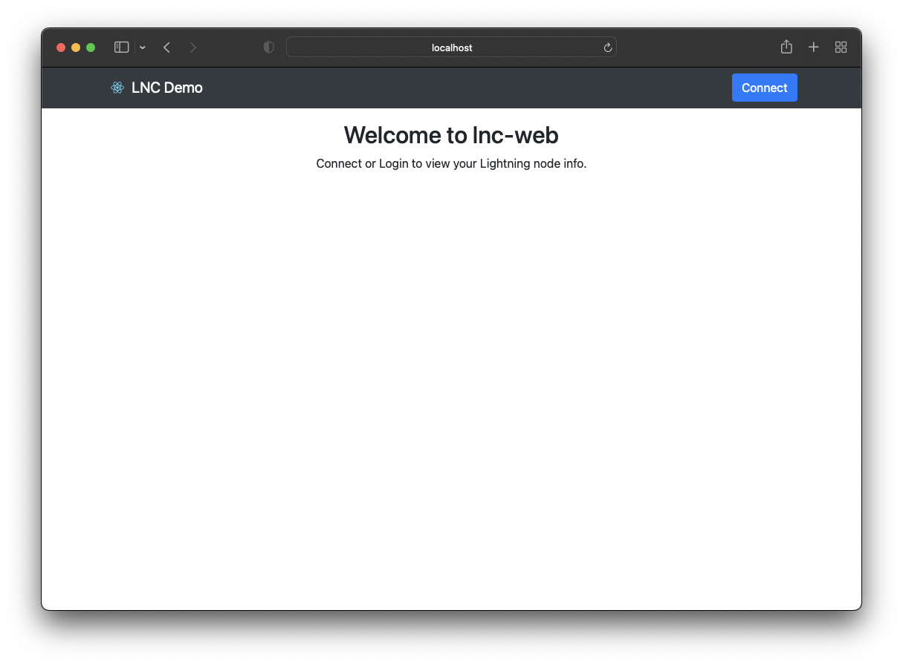
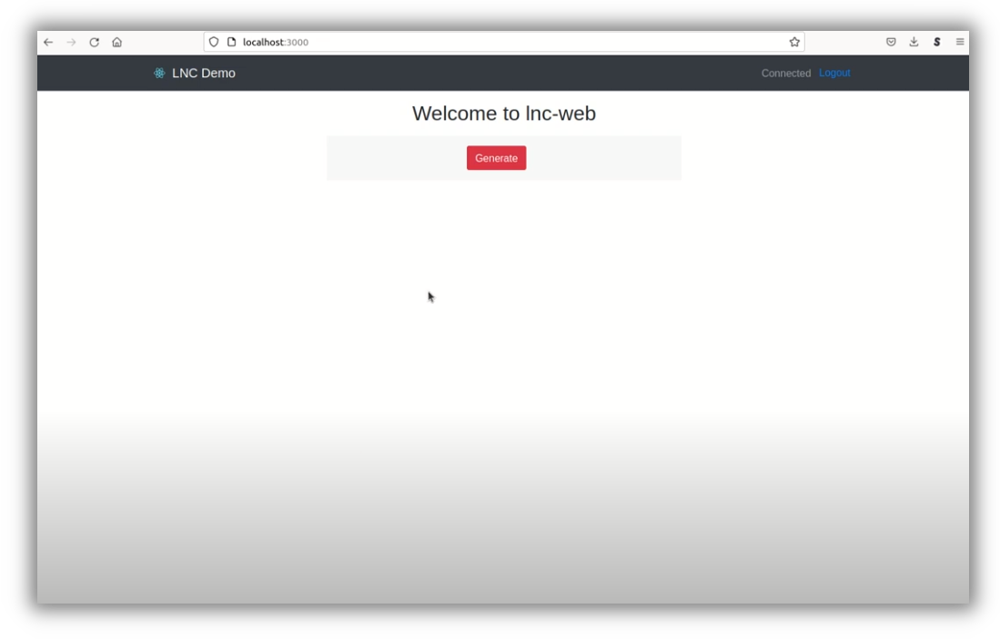

# Make your own LNC-powered application

[Lightning Node Connect (LNC)](../../lightning-network-tools/lightning-terminal/lightning-node-connect.md) is a standard to create an end-to-end encrypted connection between your node and a web or mobile app. It is used by [Lightning Terminal](../../lightning-network-tools/lightning-terminal/), Alby and Zeus to give convenient access to your node across a firewall or NAT.

LNC is bundled in litd and is available as a standalone npm package for [React Native](https://github.com/lightninglabs/lnc-rn) and [web](https://github.com/lightninglabs/lnc-web).

In this demonstration we are going to use the [LNC demo web app](https://github.com/lightninglabs/lnc-web/tree/main/demos/connect-demo) to build our own application that connects to our Lightning node.


Building Lightning Apps with Lightning Node Connect


## Intro <a href="#docs-internal-guid-6fd0d7b1-7fff-5441-93e1-ec53abd6340f" id="docs-internal-guid-6fd0d7b1-7fff-5441-93e1-ec53abd6340f"></a>

In the initial state, this demo app allows a user to enter their node alias into a form. This alias is then used to generate a Lightning meme.\
\
This guide will walk you through the process of adding LNC to the web app to allow users to connect their node and automatically pull in their node alias to be used to generate custom images.

You will need to have an LND Lightning node with litd available.

## Installation

NodeJS is required to install the demo application.&#x20;

1.  Clone the repo and checkout the pre-lnc branch\
    `git clone https://github.com/HannahMR/lnc-web/`

    `cd lnc-web/meme-demo`

    `git checkout pre-lnc`
2. Install the dependencies
3. Start the web app

Your browser should open to [http://localhost:3000](http://localhost:3000) where you will see the application’s landing page.

First we are going to a look at the structure of this simple web app. Notable are components and pages. By default only one page is available: Home.tsx. There is one component for our page, and one that the node alias into the form to generate our meme.


## Upgrade with LNC <a href="#docs-internal-guid-8615f895-7fff-c40a-ab03-6a9523670b63" id="docs-internal-guid-8615f895-7fff-c40a-ab03-6a9523670b63"></a>

We’re going to make the changes that automatically pull the node alias.

First we’ll add lnc-web as a dependency by adding the below line the the list of dependencies in the `package.json` file.

`@lightninglabs/lnc-web": "0.2.1-alpha",`

`npm install`

And for this project we’ve created a useLNC hook. We’ll need to create a new directory inside src called hooks, and add the `useLNC.ts` file.

### useLNC.ts <a href="#docs-internal-guid-adaf76e3-7fff-d13e-1627-d99c82ffe39b" id="docs-internal-guid-adaf76e3-7fff-d13e-1627-d99c82ffe39b"></a>

```typescript
import { useCallback } from 'react';
import LNC from '@lightninglabs/lnc-web';

// create a singleton instance of LNC that will live for the lifetime of the app
const lnc = new LNC({});

/**
 * A hook that exposes a single LNC instance of LNC to all components that need it.
 * It also returns a couple helper functions to simplify the usage of LNC
 */
const useLNC = () => {
  /** Connects to LNC using the provided pairing phrase and password */
  const connect = useCallback(async (pairingPhrase: string, password: string) => {
	lnc.credentials.pairingPhrase = pairingPhrase;
	await lnc.connect();
	// verify we can fetch data
	await lnc.lnd.lightning.listChannels();
	// set the password after confirming the connection works
	lnc.credentials.password = password;
  }, []);

  /** Connects to LNC using the password to decrypt the stored keys */
  const login = useCallback(async (password: string) => {
	lnc.credentials.password = password;
	await lnc.connect();
  }, []);

  return { lnc, connect, login };
};

export default useLNC;
```

We’ll add two new pages, Login and Connect, which give users the forms they need to enter their connection info and then pass that info along to the LNC module.

### Login.tsx <a href="#docs-internal-guid-41d18f6e-7fff-59d7-97ed-7f136c8525c9" id="docs-internal-guid-41d18f6e-7fff-59d7-97ed-7f136c8525c9"></a>

```typescript
import React, { useCallback, useEffect, useState } from 'react';
import { Alert, Button, Col, Form, Row } from 'react-bootstrap';
import { useNavigate } from 'react-router-dom';
import Page from '../components/Page';
import useLNC from '../hooks/useLNC';

const Login: React.FC = () => {
  const { lnc, login } = useLNC();
  const navigate = useNavigate();
  const [password, setPassword] = useState('');
  const [loading, setLoading] = useState(false);
  const [error, setError] = useState('');

  useEffect(() => {
	// preload the WASM file when this component is mounted
	lnc.preload();
  }, [lnc]);

  const handleSubmit = useCallback(
	(e: React.FormEvent<HTMLFormElement>) => {
  	// wrap LNC calls into an async function
  	const connect = async () => {
    	e.preventDefault();
    	try {
      	setLoading(true);
      	setError('');
      	if (!password) throw new Error('Enter a password');

      	// connect to the litd node via LNC
      	await login(password);

      	navigate('/');
    	} catch (err) {
      	setError((err as Error).message);
      	// tslint:disable-next-line: no-console
      	console.error(err);
    	} finally {
      	setLoading(false);
    	}
  	};
  	connect();
	},
	[password, navigate, login],
  );

  const handleClear = useCallback(() => {
	lnc.credentials.clear();
	navigate('/connect');
  }, [navigate, lnc]);

  return (
	<Page>
  	<h2>Connect to Lightning Terminal</h2>

  	{error && <Alert variant="danger">{error}</Alert>}

  	<Form onSubmit={handleSubmit}>
    	<Form.Group className="mb-3" controlId="formBasicPassword">
      	<Form.Label>Password</Form.Label>
      	<Form.Control
        	type="password"
        	autoComplete="new-password"
        	value={password}
        	onChange={e => setPassword(e.target.value)}
        	disabled={loading}
      	/>
      	<Form.Text className="text-muted">
        	Enter the password that was used when previously connecting with the pairing
        	phrase
      	</Form.Text>
    	</Form.Group>
    	<Row>
      	<Col>
        	<Button variant="primary" type="submit" disabled={loading}>
          	Submit
        	</Button>
      	</Col>
      	<Col className="text-right">
        	<Button variant="link" type="button" disabled={loading} onClick={handleClear}>
          	Connect using a different pairing phrase
        	</Button>
      	</Col>
    	</Row>
  	</Form>
	</Page>
  );
};

export default Login;
```

### Connect.tsx <a href="#docs-internal-guid-1216acf6-7fff-112f-65ef-d1b5cca91d10" id="docs-internal-guid-1216acf6-7fff-112f-65ef-d1b5cca91d10"></a>

```typescript
import React, { useCallback, useEffect, useState } from 'react';
import { Alert, Button, Form } from 'react-bootstrap';
import { useNavigate } from 'react-router-dom';
import Page from '../components/Page';
import useLNC from '../hooks/useLNC';

const Connect: React.FC = () => {
  const { lnc, connect } = useLNC();
  const navigate = useNavigate();
  const [phrase, setPhrase] = useState('');
  const [password, setPassword] = useState('');
  const [loading, setLoading] = useState(false);
  const [error, setError] = useState('');

  useEffect(() => {
	// preload the WASM file when this component is mounted
	lnc.preload();
  }, [lnc]);

  const handleSubmit = useCallback(
	(e: React.FormEvent<HTMLFormElement>) => {
  	// wrap LNC calls into an async function
  	const connectAsync = async () => {
    	e.preventDefault();
    	try {
      	setLoading(true);
      	setError('');
      	if (!phrase || !password) throw new Error('Enter a phrase and password');

      	// connect to the litd node via LNC
      	await connect(phrase, password);

      	navigate('/');
    	} catch (err) {
      	setError((err as Error).message);
      	// tslint:disable-next-line: no-console
      	console.error(err);
    	} finally {
      	setLoading(false);
    	}
  	};
  	connectAsync();
	},
	[phrase, password, navigate, connect],
  );

  return (
	<Page>
  	<h2>Connect to Lightning Terminal</h2>

  	{error && <Alert variant="danger">{error}</Alert>}

  	<Form onSubmit={handleSubmit}>
    	<Form.Group className="mb-3" controlId="formBasicEmail">
      	<Form.Label>Pairing Phrase</Form.Label>
      	<Form.Control
        	autoComplete="off"
        	value={phrase}
        	onChange={e => setPhrase(e.target.value)}
        	disabled={loading}
      	/>
      	<Form.Text className="text-muted">
        	Obtain a new pairing phrase from <code>litd</code> and enter it here
      	</Form.Text>
    	</Form.Group>
    	<Form.Group className="mb-3" controlId="formBasicPassword">
      	<Form.Label>Create Password</Form.Label>
      	<Form.Control
        	type="password"
        	autoComplete="new-password"
        	value={password}
        	onChange={e => setPassword(e.target.value)}
        	disabled={loading}
      	/>
      	<Form.Text className="text-muted">
        	lnc-web stores connection data in localStorage. This password will be used to
        	encrypt the data at rest.
      	</Form.Text>
    	</Form.Group>
    	<Button variant="primary" type="submit" disabled={loading}>
      	Submit
    	</Button>
  	</Form>
	</Page>
  );
};

export default Connect;
```

### App.tsx <a href="#docs-internal-guid-e862e1fa-7fff-fc53-6fbb-820c66cc0016" id="docs-internal-guid-e862e1fa-7fff-fc53-6fbb-820c66cc0016"></a>

We’ll also need to make sure that our App file knows about these new pages. We’ll import the two new pages.

`import Connect from './pages/Connect';`\
`import Login from './pages/Login';`

Next we’ll add these paths to our routes.

\<Route path="connect" element={\<Connect />} />\
\<Route path="login" element={\<Login />} />

Now we will need to update our MakeMeme component, we’ll alter that to import the useLNC hook, check that we are connected to a node, and then remove the form we had been using to collect node alias data, and replace it with the alias of the node that we are connected to.

First, adding the useLNC hook.

`import useLNC from '../hooks/useLNC';`

Then we’ll add two constants to MakeMeme.

`const {lnc} = useLNC();`\
`const [info, setInfo] = useState<any>();`

We’ll now also need to remove some obsolete code.&#x20;

We no longer need to track memeText as we will be pulling that in from our connection to the node.

`const [memeText, setMemeText] = useState(null);`

We can remove most of our form as we no longer need to directly collect this information from our users.

&#x20;  `<Form.Group className="mb-3" controlId="exampleForm.ControlInput1">`\
&#x20;     `<Form.Label><strong>Write your LNC Node here</strong></Form.Label>`\
&#x20;      `<Form.Control`\
&#x20;        `as="textarea"`\
&#x20;        `rows={2}`\
&#x20;        `placeholder="Paste your node alias here, then click generate"`\
&#x20;        `onChange={(e) => setMemeText(e.target.value)}`\
&#x20;      `/>`\
&#x20;  `</Form.Group>`

We’ll add a useEffect function adding the below code just after our constants at about line 15.

&#x20;    `useEffect(() => {`\
`if (lnc.isConnected) {`\
&#x20;  `const sendRequest = async () => {`\
&#x20;    `const res = await lnc.lnd.lightning.getInfo();`\
&#x20;    `setInfo(res);`\
&#x20;  `};`\
&#x20;  `sendRequest();`\
`}`\
&#x20; `}, [lnc.isConnected, lnc.lnd.lightning]);`\
&#x20; `if (!lnc.isConnected || !info) return null;`

We’ll need to update the variable we are using for the text that we will be adding to our meme in two spots. On what is likely now line 54 and line 89 we’ll change

`{memeText}`

to

`{info.alias}`

### Page.tsx <a href="#docs-internal-guid-f6ae97a6-7fff-c339-85a6-c106f3fccccf" id="docs-internal-guid-f6ae97a6-7fff-c339-85a6-c106f3fccccf"></a>

We’ll need to update our Page component as well. First we are importing our useLNC hook.

`import useLNC from '../hooks/useLNC';`

Then we’ll add a constant for LNC to Page.

`const { lnc } = useLNC();`

We add the below inside Navbar.Collapse

&#x20; `<Nav className="ml-auto">`\
&#x20;          `{lnc.isConnected ? (`\
&#x20;            `<>`\
&#x20;              `<Navbar.Text>Connected</Navbar.Text>`\
&#x20;              `<a href="/">`\
&#x20;                `<Button variant="link">Logout</Button>`\
&#x20;              `</a>`\
&#x20;            `</>`\
&#x20;          `) : lnc.credentials.isPaired ? (`\
&#x20;            `<Link to="/login">`\
&#x20;              `<Button>Login</Button>`\
&#x20;            `</Link>`\
&#x20;          `) : (`\
&#x20;            `<Link to="/connect">`\
&#x20;              `<Button>Connect</Button>`\
&#x20;            `</Link>`\
&#x20;          `)}`\
&#x20;        `</Nav>`

### Home.tsx <a href="#docs-internal-guid-c2883ea9-7fff-2a19-f150-faaa4744ed29" id="docs-internal-guid-c2883ea9-7fff-2a19-f150-faaa4744ed29"></a>

Of course our home page will need to know about our new connect option.&#x20;

Again we’ll import the useLNC hook

`import useLNC from '../hooks/useLNC';`

Add we’ll add a constant inside Home.

`const { lnc } = useLNC();`

Inside the page div we’ll add a paragraph that displays instructions based upon if a user is connected to our web app.

&#x20; `<p className="text-center">`\
&#x20;    `{lnc.isConnected`\
&#x20;      `? 'You are now connected to your Lightning node.'`\
&#x20;      `: 'Connect or Login to view your Lightning node info.'}`\
&#x20; `</p>`

## Connect your node to the upgraded app <a href="#docs-internal-guid-e7803a82-7fff-27bd-78c2-53466e512b3e" id="docs-internal-guid-e7803a82-7fff-27bd-78c2-53466e512b3e"></a>

After all these changes we should be able to refresh our app and receive a message asking us to connect our node.

<figure><figcaption><p>Your app's welcome page.</p></figcaption></figure>

This is where we need to head over to our node and use litd to generate a connection string.

`litcli --lndtlscertpath ~/.lit/tls.cert sessions add --label=”LNC Connect!”`

Note that you may need to adjust this connection to suit your node, for example by adding the `--testnet` flag if you are operating there. Be sure to omit the `--type admin` flag so that a read only connection string is generated. We should only require the permissions that we absolutely need.

After entering your litd UI password you can find your connection string in the output labeled as “pairing\_secret\_mnemonic.”

We can then head back to our web app, click the connect button, enter our connection phrase, set a password and connect!

Once we are connected we’ll see the option to generate a meme:

<figure><figcaption><p>Once connected to your app over LNC, your users will be able to generate their meme.</p></figcaption></figure>

Push the button and see what meme you get!

Congratulations!
