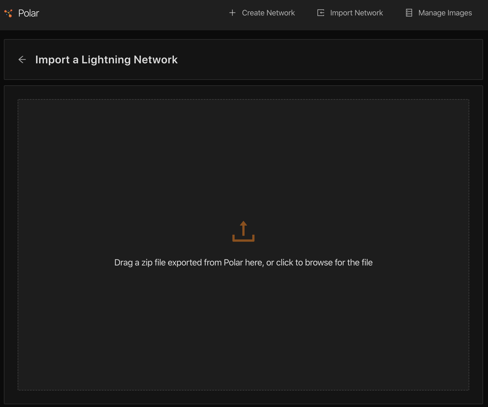
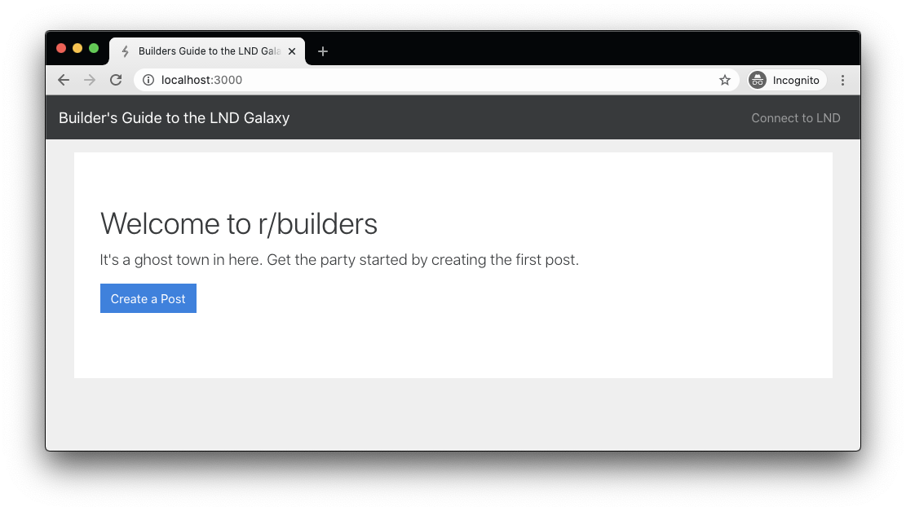
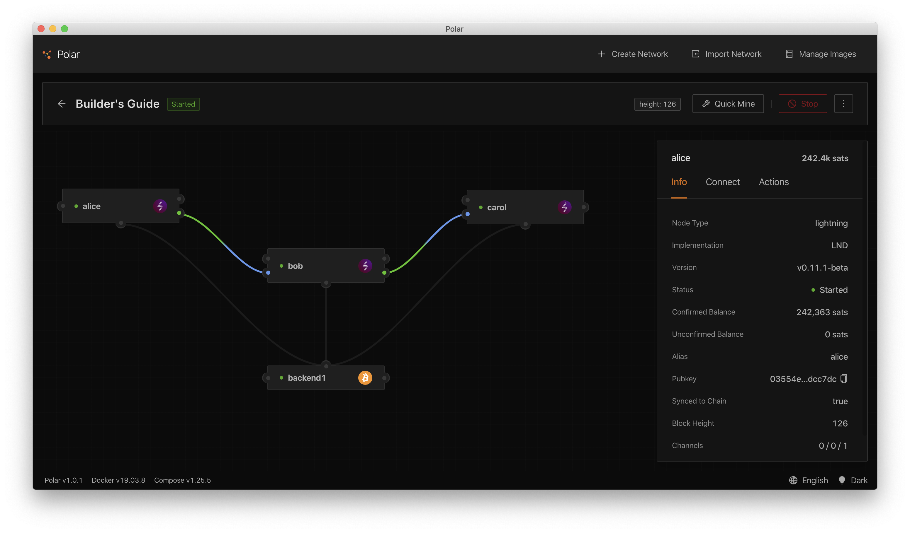

# Setup: Run the Completed App

Now that you are familiar with Polar, we are going to build a web application that leverages a pre-defined Polar network as its backend. First, we will ensure your development environment is correctly configured. Next, we will import this pre-defined network. Then, we will run the completed sample app so you can see how it works.

In the next section, we will strip the completed sample app down and rebuild the Lightning integration together.

## Development Environment Setup

In order to run the web app locally, first install [NodeJS v12.x](https://nodejs.org/en/download/) on your computer. Next, install [Yarn v1.x](https://classic.yarnpkg.com/en/docs/install) either from the link, or by opening up a Terminal and running:

```text
npm install -g yarn
```

After getting both of the requirements installed, you’ll need to clone the `builders-guide-sample-app` repo from GitHub and install its dependencies. To do this, run the following commands from your open Terminal:

```text
git clone https://github.com/lightninglabs/builders-guide-sample-app.git
cd builders-guide-sample-app
yarn
```

## Import the Pre-Defined Network

With the `builders-guide-sample-app` repo cloned to your local machine, return to Polar and click the **Import Network** button at the top of your screen to display the following interface.



Click to browse to your local `builders-guide-sample-app` folder, and select **builders-guide.polar.zip** in the _resources_ folder. You should be faced with the below screen.


Press Start to download the requisite docker images and simulate your new regtest Lightning Network.

## Play with the Completed Sample App

If you’d like to play with the final app, with Lightning integrated, before diving into the code, follow along here. If you’d rather work your way up to the final app, jump ahead to the next section.

Checkout the final branch and start the app:

```text
git checkout final
yarn dev
```

Open your browser to [http://localhost:3000](http://localhost:3000) if it doesn’t open automatically.



You should see the screen above after launching the app.

In order to test out all of the functionality, you’ll need to have the predefined network started according to the instructions above. If you've successfully done so, your Polar instance should look like the screenshot below.



The app requires multiple users to explore all of its functionality. Open a second window side by side with the first one, and navigate to [http://localhost:3000](http://localhost:3000). Feel free to poke around the app yourself. Here are some guided steps you can perform to see all of the features.

First Window:

1. In the webapp, click the **Connect to LND** link in the top navbar
2. In Polar, navigate to alice's **Connect** dashboard, and copy the _GRPC Host_ url into the webapp's _LND Host_ field.
3. Select **HEX** instead of **File Path** in the bottom half of the **Connect** dashboard, and copy that version of _TLS Cert_ into the webapp's _TLS Certificate_ field.
4. Right click on alice's `lnd` node, select **Launch Terminal**, paste in `lncli bakemacaroon info:read offchain:read invoices:read invoices:write message:read message:write` as instructed by the webapp, copy the output and paste it into the webapp's _Macaroon_ field, and finally click the Submit button.
5. You will be redirected back to the home screen where you’ll see alice’s name and her channel balance \(115,048 sats\) in the top navbar.
6. Click on the **Create a Post** button.
7. Enter a _Title_ and _Content_ for the post in the form, then click on the **Submit** button.
8. You will be redirected back to the main screen where you'll see the post you just created.
9. Create a couple more posts if you’d like to by repeating steps 4 & 5.

Second Window:

1. Notice that the posts you created as alice are also visible in this tab. If not, refresh the page.
2. Click the **Connect to LND** link in the top navbar.
3. In Polar, navigate to carol's **Connect** dashboard, and copy the _GRPC Host_ url into the webapp's _LND Host_ field.
4. Select **HEX** instead of **File Path** in the bottom half of the **Connect** dashboard, and copy that version of _TLS Cert_ into the webapp's _TLS Certificate_ field.
5. Right click on carol's `lnd` node, select **Launch Terminal**, paste in `lncli bakemacaroon info:read offchain:read invoices:read invoices:write message:read message:write` as instructed by the webapp, copy the output and paste it into the webapp's _Macaroon_ field, and finally click the Submit button.
6. You will be redirected back to the home screen where you’ll see carol’s name and her channel balance \(125,000 sats\) in the top navbar.
7. On the first post created, click the _Verify Signature_ button
8. The button should disappear and a green verified badge should appear in both tabs.
9. Click on the _Upvote_ button for the first post.
10. A popup will appear with a Lightning payment request string generated by alice for her post. Copy this to your clipboard.
11. In Polar, right click on the carol node and choose the **Pay Invoice** option.
12. Paste the payment request string into the BOLT 11 Invoice field in Polar, then click the **Pay Invoice** button.
13. Switch back to the two browser tabs and notice the post now displays 1 vote under the content.
14. In the first window, alice’s balance in the navbar has increased by 100 sats to 116,048 sats, and in the second window, carol's balance in the navbar has decreased by 101 sats to 124,899 sats.

Now that you’ve seen all of the amazing features our Lightning App has, dive into the code in the next section to learn how this app was built.

