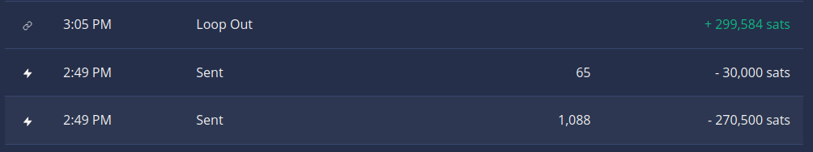
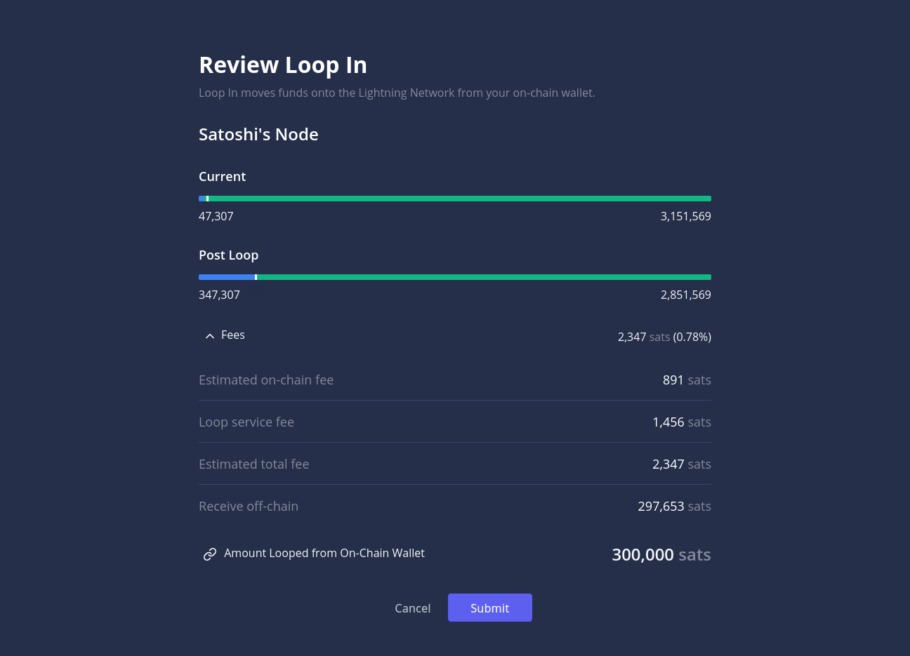
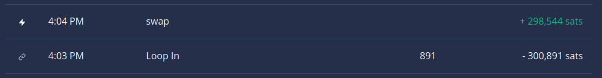

# Loop Fees

Loop is a service that allows its user to perform non-custodial Submarine Swaps between on-chain and off-chain bitcoin.To perform these swaps, the service charges a fee on top of the on-chain and off-chain fees that these transactions occur naturally.

[Read more: Understanding Submarine Swaps](../../the-lightning-network/multihop-payments/understanding-submarine-swaps.md)

## Loop Out 

A Loop Out allows you to trade your off-chain balance for on-chain bitcoin. There are multiple fees that will occur:

### Estimated fees

Loop will give us an estimate over the fees we are expected to pay before we confirm our swap. These fees depend on transaction size and current demand for on-chain payments and fall into three categories:

**L402**: When you perform your first Loop your node will purchase an [L402](../../the-lightning-network/l402/). This L402 does not expire and costs 1 satoshi.

**Estimated on-chain fee**: This is the fee you are expected to pay in miners fees to claim your bitcoin from the [HTLC address](../../the-lightning-network/multihop-payments/understanding-submarine-swaps.md#3.-claim-bitcoin-from-the-smart-contract) into your personal wallet. This fee is calculated based on current on-chain fee conditions and may be higher if by the time the Loop Out concludes the mempool is significantly more congested. Larger transaction sizes do not increase this fee, but faster desired confirmation times do.

**Loop service fee**: This is the fee the Loop service will charge for the swap. It depends on current on-chain fees charged by the Bitcoin network.

**No show penalty**: Before the Loop Out commences, you are asked to pre-pay 30,000 sats. This payment is counted towards your Loop Out and will be forfeited if your final payment is not made to cover the cost of capital being locked into the HTLC as well as on-chain fees needed to recover it.

In the below example we expect to pay a fee of 1,312 satoshis to swap 300,000 satoshis to our on-chain wallet.

### Actual fees 

After we have performed our swap, we can calculate the total fees we paid in the History section of Lightning Terminal.

**Off-chain payments**: We should see two outgoing off-chain payments, one over 30,000 satoshis, the other over the remaining swap amount plus the fees paid to the Loop service. Together, they represent the amount paid to Loop.

**Off-chain fees**: Each of these off-chain payments carried an additional off-chain fee, paid to the routing nodes that delivered these payments to Loop. Fees paid: 1,088 + 65 = 1153 sat)

**On-chain fees**: The on-chain fees aren’t explicitly listed, but we can calculate them from the difference between the on-chain funds we intended to swap (300,000 sat) and the incoming payment to our wallet. In the example below we paid 416 sat to sweep our HTLC.

**Loop fee**: We can calculate the fee paid to Loop by subtracting our desired Loop Out amount from the total we sent to Loop. In the below case we paid 500 sat in fees to Loop

## Loop In 

A Loop In allows us to replenish a channel with on-chain funds.

### Estimated fees

Similar to the above, we will receive an estimate of our fees before we confirm our action. The fees depend on transaction sizes, confirmation targets and on-chain demand.

**Estimated on-chain fee**: This is the fee we expect to pay to publish our on-chain transaction. It depends on on-chain demand and can also be significantly higher if our wallet has to bundle multiple utxos.

**Loop service fee**: This is the fee that Loop will take from our swap. It includes the on-chain fees to sweep the HTLC and the off-chain fees for Loop’s payment to you.

### Actual fees 

After our swap is complete, we can inspect the total fees we paid.

**On-chain payment:** Our on-chain payment is made over the total amount we want to Loop In. In the user interface it will show including the on-chain fee.

**On-chain fee**: The miner fee we had to pay to publish our transaction. If for some reason the Loop In were to fail after our on-chain transaction is confirmed, we would have to make another on-chain transaction to sweep the HTLC ourselves, costing us more on-chain fees.

**Loop service fee**: We can calculate this fee by subtracting the satoshis we received in our off-chain payment from the swap amount. In our example we paid 1,456 sats in fees. This fee includes the off-chain fees paid by Loop to deliver our payment to our node, the miners fee paid by Loop to sweep the HTLC and the Loop fee.

