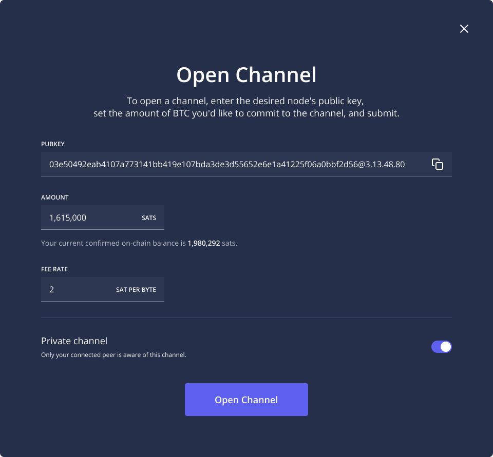

# Opening Lightning Network Channels

On the Lightning Network, money moves from sender to receiver through payment channels. These channels are 2-of-2 multisignature contracts with bitcoin held cooperatively by two peers running Lightning Network nodes.

The network today consists of tens of thousands of payment channels connected by thousands of nodes. All payments on the network move from one node to another by shifting the balance of liquidity within one or more channels.&#x20;

## Why Lightning Channels are important

Therefore, every active node on the Lightning Network must have at least one open channel to send or receive payments, and most active routing nodes have many. As nodes open new channels, they become better connected on the Lightning Network. Increased connectivity helps nodes route payments to and from more nodes with lower fees. Sufficient liquidity, meaning the ability to send, receive and route, is an important condition to making these payments work.

The first step to opening a Lightning Network channel is identifying a good peer.&#x20;

### How to find good peers

Good peers on the Lightning Network are nodes that are well connected to the rest of the network and maintain a high level of uptime. In most cases, the number of channels your node has with good peers is more important than the total number of channels it has. Well connected peers increase your chances of being able to successfully route payments on the Lightning Network.

Finding and connecting with good peers is now easier than ever on Lightning Terminal. Once you have connected your node, Terminal will suggest [recommended channels](recommended-channels.md) to connect with depending on the number of open channels your node has.

[Learn more about how to identify good peers.](../../the-lightning-network/routing/identify-good-peers.md)

### How to open a Lightning Network channel 

To open a channel on the Lightning Network, you will first need bitcoin. Your Lightning nodes can provide you with an address to receive bitcoin.

For example, on Umbrel, users can click the Bitcoin tab in the dashboard, click deposit, and send bitcoin to their Umbrel node’s bitcoin address.

Once your node has been funded, you will be able to use Terminal to open a channel with any other Lightning node on the network, as long as it is reachable and accepts your channel request.

As long as your node is available, other nodes on the Lightning Network will also be able to open channels with you.

Most node solutions create a public node by default, which is one that can be viewed on the Lightning Network graph and used as a routing node for passing payments through the network.

By opening channels with many different nodes, a node operator can improve their ability to route payments across the network. This is just one of a few important indicators of a healthy node.

[Learn more about what makes a good routing node.](../../the-lightning-network/routing/what-makes-a-good-routing-node.md)

### Find a good peer 

The relentless competition between nodes and the fluctuating balance of payments between nodes makes it impossible to know exactly which channels are optimal for earning routing fee revenue at any given time.

After all, if it were possible to predict exactly which channels would produce outsized earnings for routing nodes, those opportunities would quickly attract competing nodes with larger channels, more connections, and lower fees until the opportunities disappeared.

Permissionless competition and unpredictable payments help level the playing field for all nodes, rewarding experimentation and good liquidity management.

[Click here for a more detailed explanation of good liquidity management on the Lightning Network.](../../the-lightning-network/liquidity/manage-liquidity.md)

While the importance of trial and error when adding new channels cannot be overstated, Terminal does have a channel recommendation feature that can help finding peers to open channels with in a way that is beneficial to your node, the peer, and the network as a whole.

[Understand how to best utilize recommended channels.](recommended-channels.md)
