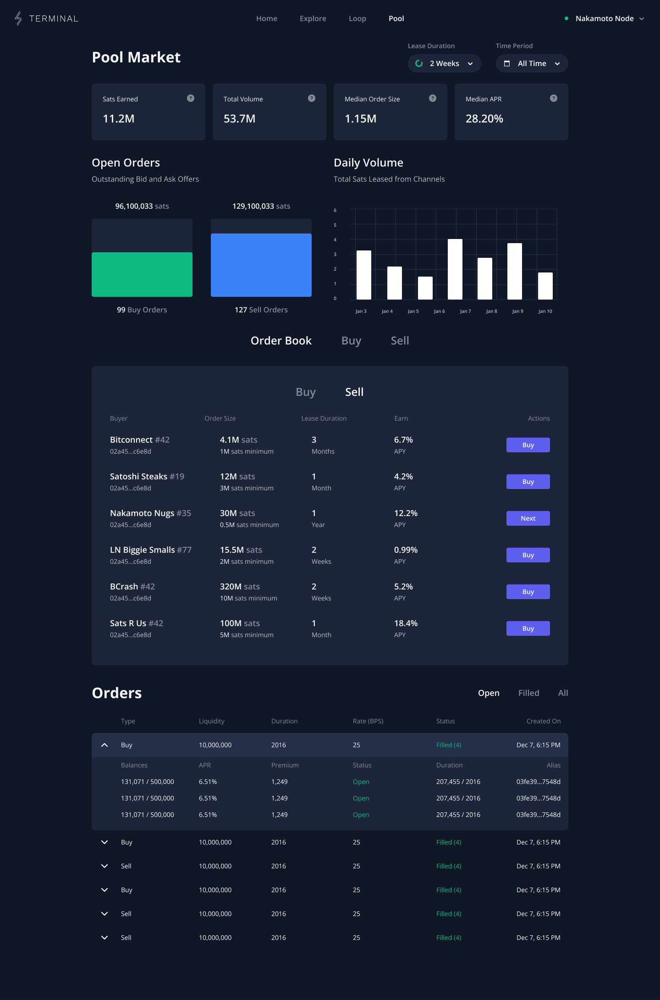

# Pool and Lightning Terminal

Lightning Terminal offers a graphical interface for Pool, making it easy and intuitive to buy, sell or redeem channels. [Lightning Pool](../pool/) is a non-custodial marketplace for channels. You can use Pool to buy channels, or sell your extra liquidity to others.

### How to use Pool in Lightning Terminal

Navigate to ‘Pool’ in [Lightning Terminal](https://terminal.lightning.engineering/#/). You will need to create and fund your account. To open it, you will need funds in your LND’s on-chain wallet.

### Open an Account

To open the account, navigate into Pool, then click on ‘Open an Account’ on the left bar of Lightning Terminal. You can define how much of your funds you want to commit to the account, how long you are willing to lock them up and how fast you want to open the account. A longer lock-up period and slower confirmation times will save you in on-chain fees.

If you want to primarily sell channels, the funds in your Pool account need to be able to cover the capacity of the channels you intend to sell. If you are only buying channels, you only need to commit enough to cover the fees.

To authenticate your account to the Pool server, your node will purchase an [LSAT](../../the-lightning-network/l402/) for 1000 satoshis. This transaction is made over the Lightning Network and you will be able to see it in your Dashboard.

### Custody

Your pool account is a 2-of-2 multisignature contract secured on the Bitcoin Blockchain. Your Pool account is time-locked, meaning after a pre-determined amount of time you are able to withdraw your funds from this contract unilaterally, but an account can be closed cooperatively anytime before.

### The auction

Pool performs a batched, uniform clearing-price auction. That means that all bids and asks are collected every ten minutes and cleared at the same price. Bids made in the Pool UI are private by default, while bids made with Pool Lite or the CLI can be configured to be private or public. Public bids of others can be inspected and matched through the Pool Lite UI.

You can place a bid (meaning you want to buy a channel lease or get inbound) or an ask (selling a channel lease or earn yield). For each, you can define the liquidity you intend to trade, the fee you want to charge or pay as well as define on-chain fees and minimum channel size. For bids you can also specify whether you are willing to accept channels from nodes not ranked on Lightning Terminal.

Pool will calculate the expected fees or earnings for you, including the annual rate. In the Pool dashboard you are able to see the clearing prices, volumes and number of orders of the recent batches. A batch can happen at most once per block, but not every block needs to have a batch in it.

### Bids

When placing a bid, you are offering to pay for inbound liquidity. You can define how much incoming liquidity you desire and how much you are willing to pay for it. Pool will calculate your fees for you, including the fees for using Pool, chain fees and an annualized rate. Review these parameters carefully before you place your bid!

As soon as you place your bid, it will appear in the ‘Orders’ list. Once somebody else has placed an ‘Ask’ for less or equal than your bid, you will be matched at a lower or equal rate and the channel is opened to you. You can see all channels opened through Pool on the right under ‘Filled channel leases.’

### Asks

If you have liquidity that you want to sell on Pool, you will need to be ‘ranked,’ meaning considered a Tier 1 (T1) node. You can see your node tier on the top right corner.

Similar to bids, state how much liquidity you are willing to provision at what rate, as well as your desired minimum channel size and on-chain fees.

Your asks will appear in the ‘Orders’ list together with your bids. You can filter by open and filled orders and see how much of the channel duration has already elapsed. Be careful not to close your channels before then!

### Register a Sidecar channel

It is not yet possible to buy [Sidecar channels](../pool/sidecar\_channels.md) through Terminal yet. However, it is possible to redeem Sidecar channels that others have ordered for you.

Return to the dashboard and click on ‘Loop,’ then "Add Liquidity." To the right of the screen you should see the option to ‘Register a Sidecar channel.’ Enter your sidecar ticket into the user interface and confirm before the channel is opened to your node.

## Pool Lite

Pool Lite is a simplified order book that visualizes the current market and provides an easy way to interact with specific bidders, or submit public and private bids yourself.

To make use of Pool Lite, you will need a regular Pool account, meaning you'll need to make an on-chain transaction from your primary or an external wallet to the Pool multisignature account.

To inspect public orders, look at the "Order Book" and scroll through the available Buy and Sell orders, the nodes placing these bids and asks and the appropriate terms. You can match directly with these orders by clicking Buy/Sell on the right and following the steps in the UI.

<figure><figcaption>
The Pool Lite UI showing the market, public and personal orders.
</figcaption></figure>

