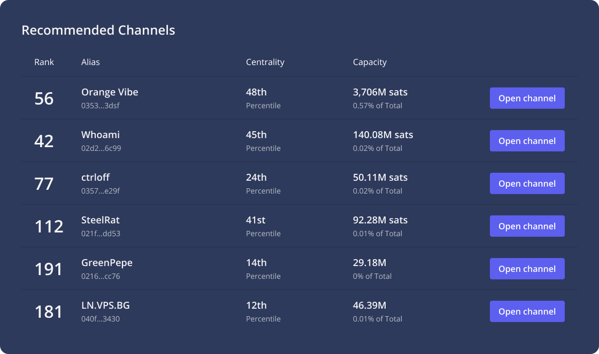

# Recommended Channels

In order to get started with a Lightning Node, node operators first need to open channels to peers. To decide what peers to open towards, node operators often do [a lot of research](../../the-lightning-network/liquidity/understanding-liquidity.md) and diligence on the other node. Within the Terminal experience, there is also the option to open “recommended channels.” What are recommended channels?

Let’s start with peers. A stable peer is one that passes five of six health checks, lacking only the health check around the number of good peers to be considered a “6/6 health check” routing node. It is these stable peers that are included as Recommended Channel options within the Terminal experience. With additional channel opens in their direction, these peers can improve their health check status thus improving the health of the network overall. Therefore, recommended channels give you a list of stable peers that if you open a channel towards them will become stronger routing nodes within the network graph.&#x20;

This list of recommended channels will be visible in Terminal either: if you have no channels, as the whole channels card or underneath your existing channels. If you are presented with this list and also pass five of six health checks, your node is likely included in the list of peers suggested to other Terminal users.

Opening a channel to such a peer is not only of benefit to your node and the new peer, but to the network as a whole, as it connects nodes on the outer edges, decentralizes routing and allocates capital where it is more likely needed.

As with other peers, opening a recommended channel does not guarantee to pass the additional health check. It is also important to capitalize the channel sufficiently and to maintain sufficient incoming and outgoing capacity.
