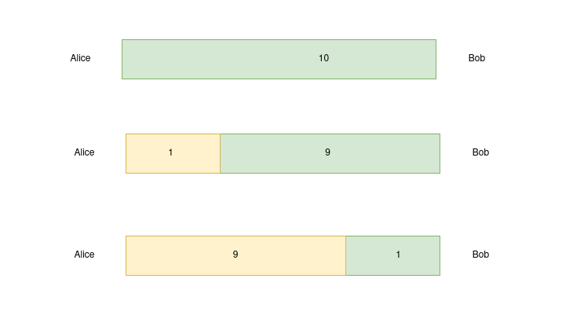

# Liquidity Management for Lightning merchants

Payments on the Lightning Network are settled instantly at a low cost for the sender and typically no cost for the receiver. Anyone can run a Lightning Network node at home or in the cloud, and there is plenty of tooling available to integrate a Lightning node into other systems, for instance, by using BTCPay or LNbits.

When running your own node to receive payments,, the obligation to manage channel liquidity falls onto you, the merchant. The concept of channel liquidity is novel to system administrators and extends beyond “keeping the lights on” and regularly updating the software. However, with Lightning Labs tooling, you can manage liquidity as easily as possible including automation and simple UX, which we’ll outline in this guide.

## Goals of this guide 

As a merchant, you want payments to your node to be as reliable as possible. Not being able to find a route can cause unnecessary user frustration, which in the worst case leads the customers to look elsewhere, or choose a payment option less advantageous for you. Due to the architecture of the Lightning Network, as a merchant, you may not even know if users are having issues paying you unless they file a report. Failed payments from users are not easily distinguishable from payments that were never attempted. Therefore, it is critical to ensure that you have sufficient liquidity in the right place at the right time.

Payments to your node should also be cheap, as excessive routing costs can make your service appear less valuable to the consumer. Typically, payment failures and high fees typically go hand in hand for mismanaged nodes.

Using the guide below, you will learn how to understand and acquire inbound liquidity, maintain it and automate the process.

## Inbound liquidity 

The Lightning Network relies on payment channels to route funds between participants. The size of these payment channels is fixed at the time of their creation, defining the total capacity of a channel. For instance, a 10 BTC channel can at maximum facilitate a transfer of 10 BTC.

Inbound liquidity describes the portion of that capacity that is held by your peer and can be forwarded to your side as part of a payment.

### Acquiring inbound liquidity 

To be able to receive payments, a merchant has to acquire inbound liquidity. There are multiple ways of achieving this.

1. Ask your clients! As a new merchant, the users most enthusiastic about Lightning payments might be able and willing to provide inbound capacity.
2. Buy channels! There are market places like Pool where channels can be purchased, as well as dedicated Lightning Service Providers specializing in liquidity services.
3. Push out payments! A merchant may also open channels themselves, then acquiring liquidity in these channels by swapping funds onchain, making Lightning payments themselves or selling Bitcoin on an exchange that supports Lightning Network deposits. This mechanism works best in the long run and is explained in more detail below.

[Read also: How to get inbound capacity on the Lightning Network](liquidity-management-for-lightning-merchants.md#docs-internal-guid-36403082-7fff-b054-0726-94934fc8d487)

### Liquidity shifts as payments are received 

When a payment is made through a channel, the balances of the channel shift.

<figure><figcaption>
Channel capacity shifts as payments are made through the channel
</figcaption></figure>

In the above example, Bob is opening a channel to Alice over 10 million satoshis, or 0.1 BTC. The total capacity of the channel will forever be 0.1 BTC, although Bob can open another channel later if needed.

Once the channel active, Alice at first has 10 million satoshis in inbound liquidity, meaning she will be able to receive payments of up to 10 million satoshis before the channel is depleted. This can be one payment, or 1 million payments of 10 satoshis.

Eventually, all funds will have moved to Alice’s side of the channel, and she can no longer receive payments through this channel.

### Maintaining inbound liquidity 

Repeatedly soliciting or buying new channels is costly, as channel peers expect to be compensated for their capital and the cost of opening and closing the channel.

Ideally, channels are reused, so the cost of opening the channel can be amortized over a longer period of time. This can be achieved by emptying channels. In the example above, Alice will need to “push out” funds through her channel with Bob to be able to receive payments again.

This can be achieved mainly in three ways:

1. Make Lightning payments. In an ideal world, a merchant would be able to pay suppliers or staff the same way they receive payments from their clients. When channels are used in both directions, fees tend to be the lowest.
2. Swap offchain funds for onchain funds, for instance using Lightning Loop. This option is preferable if the funds are to be held in Bitcoin, for example as a reserve or savings account. This process can be automated using Autoloop in the Lightning Terminal UI.
3. If funds need to be converted to fiat currencies, this is ideally done through platforms that support Lightning Network deposits. This minimizes onchain fees and allows channels to be open longer.

[Read more: Using Autoloop to acquire inbound capacity.](../../lightning-network-tools/lightning-terminal/loop.md)

### Identifying good peers 

Good peers are peers that most reliably and cheaply route payments to your node. As a rule of thumb, whatever channels deplete the quickest, these are your best peers.

Another metric of a good peer is your cost of pushing out payments. If a peer reliably routes payments to you, but charges significantly more to push out payments than other peers, you may deprioritize maintenance on their channel.

[Read more: Autoloop configuration](../../lightning-network-tools/loop/autoloop.md)

## Summary

* Avoid closing channels unless peers are offline or funds cannot be pushed out through the Lightning Network
* Identify your good peers and regularly push payments out through their channel, either by making Lightning payments yourself or swap funds into your onchain wallet with Loop or Autoloop.

