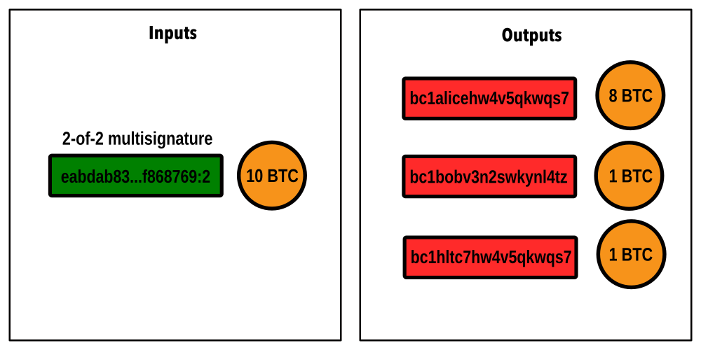

# Hash Time-lock Contract \(HTLC\)

Hash Time-lock Contracts \(HTLCs\) are the centerpiece of any Lightning transaction. While your Lightning Network channel is a 2-of-2 multisignature address with funds on the bitcoin blockchain, a HTLC is an output of an unconfirmed transaction to a separate “smart contract” address with the following properties:

1. The smart contract can be spent by revealing a “secret’ together with a valid signature of the recipient
2. The smart contract can be redeemed after a set amount of time together with a valid signature of the sender.

HTLCs with the above conditions also find application outside the Lightning Network. When used to transfer funds through a Lightning channel, a HTLC also comes with a third condition:

3. The smart contract can be spent immediately by someone presenting a revocation key.

Ideally, this transaction never needs to be committed onto the blockchain. Instead, when the preimage is revealed by the recipient, the balances of the channel can be updated, creating a new commitment transaction and invalidating the previous one.

## **1\) The commitment transaction**


The commitment transaction of a regular payment channel can be visualized as above. It contains a single input. This input represents the channel point, or transaction ID of the channel. The transaction referenced by this input is recorded on the blockchain and can only be spent with a transaction signed both by Bob and Alice. The commitment transaction is signed by both Alice and Bob, and spends the channel balance \(10 BTC\) according to their channel balances, in this case 9 BTC to Alice  and 1 BTC to Bob.

## **2\) A HTLC is created**



Alice is now presented with an invoice over 1 BTC. She creates a new commitment transaction that reduces her balance to 8 BTC, while keeping Bob’s balance at 1 BTC. A new output over 1 BTC is created. This output is the HTLC, and follows the rules of a HTLC as outlined above. The script of this address might look like this:

```text
IF <revocation pubkey>
ELSE IF <hash(preimage)>
    <recover pubkey>
ELSE CHECKLOCKTIME
    <sender pubkey>
```

Depending on the route chosen, Bob might now forward this HTLC by creating a new commitment transaction for one of his channels, removing 1 BTC from his channel balance. Then, he commits it into a HTLC with the same preimage hash with a swapped recover pubkey of his channel peer and his sender pubkey.

## 3\) A HTLC is consolidated


Once the recipient of the 1 BTC payment sees a commitment transaction with a 1 BTC HTLC made to the hash of the preimage, they can safely reveal the preimage. Now, the HTLC can be consolidated back into the channel balance. In this case, Bob will create a new commitment transaction that removes the HTLC output and instead adds its balance to his channel balance. Alice, aware that Bob knows the preimage and could claim the HTLC on-chain, has an interest in co-signing this new commitment transaction. The payment cycle is complete.

An HTLC might also get consolidated because the payment could not be completed. In this case Alice will create a new commitment transaction that updates her balance back to its earlier state in step \(1\). Bob, aware of being unable to claim the HTLC for themselves, has an interest in signing this transaction to keep the channel alive.

## 4\) A HTLC is settled on-chain

In some rare events, the HTLC needs to be settled on-chain. This could happen in the event that Alice does not co-sign the new commitment transaction meant to consolidate the HTLC, for example because she has become unresponsive.

Settling an HTLC will cause a force-close of the channel and lock up its funds. Depending on whether the preimage is known the HTLC can be redeemed immediately, or once the waiting period has passed.

There is also the possibility that an old, revoked HTLC is committed to the chain. In this case the revocation key can be used to take the funds by the other party.

## 5\) Multi-hop payments

The main use of HTLCs is to safely enable payments through multiple channels. With HTLCs, payments can be made atomically, meaning they either fail entirely or succeed. Furthermore, a routing node is not able to take funds at any point. To achieve this, all peers along a route will construct their HTLCs from the same hash of the same secret preimage. They can rest assured that for their outgoing peer to be able to claim the funds they send, the preimage needs to be revealed, allowing them to likewise claim their funds from their incoming peer.

To remove racing conditions, meaning an execution in which the wrong sequence can lead to undesired consequences , peers along a route will want their HTLCs to expire in the order in which they can be redeemed. Thus, if an HTLC is settled on-chain, by the ultimate recipient, the preimage revealed in that transaction becomes known to their channel peer who can then claim their HTLC.

## 6\) **HTLC constraints**

### **A\) Asymmetry**

Similar to commitment transactions, there is an asymmetry with regard to HTCLs. In that, depending on who attempts to commit the HTLC on chain, a different revocation key and waiting period is applied. \(E.g. if Alice commits her transaction, Bob can contest the HTLC with his key, or the other way around.\)

### **B\) Waiting period**

The waiting period can be defined individually for each channel at its creation using the `--max_local_csv` and `--remote_csv_delay` flags of `lncli openchannel`. A large waiting period makes it safer to recover from a failure, but will also lock up funds for longer if a channel closes unilaterally.

### **C\) CLTV delta**

The time lock delta \(or CLTV expiry delta\) is the minimum difference between the expiration of an incoming and outgoing HTLC. This delta ensures that there is always enough time to settle an HTLC, even if previous HTLCs are settled on-chain at the last minute. It can be set using the `--time_lock_delta` flag of `lncli updatechanpolicy` or in the configuration file.

`bitcoin.timelockdelta=40`

### **D\) HTLC size**

For each channel, you can define the minimum and maximum HTLC size. It might be rational to set a minimum HTLC size with `--min_htlc_msat` to not risk a channel closure for a small HTLC, or a HTLC that cannot be settled on-chain due to the dust limit.

### **E\) Maximum value in flight**

It’s also possible to limit the total number of satoshis that can be pending at any point in a channel using `--remote_max_value_in_flight_msat` at the channel opening.

### **F\) Multiple HTLCs**

Each channel can handle hundreds of HTLCs at once. The maximum limit of 483 is set as the default, although this can be reduced in the configuration file.

`default-remote-max-htlcs=483`

**Example usage:**

`lncli updatechanpolicy --base_fee_msat 100 --fee_rate 0.00001 --time_lock_delta 50 --min_htlc_msat 1000 --chan_point 17ec2d0ac18d953b1dfe2cafa116b0c118020cab4d80c4063fe98debda6df469:1`

`lncli openchannel --node_key 021c97a90a411ff2b10dc2a8e32de2f29d2fa49d41bfbb52bd416e460db0747d0d --connect 50.112.125.89:9735 --local_amt 210000000 --remote_max_value_in_flight_msat 105000000000 --max_local_csv 50`

