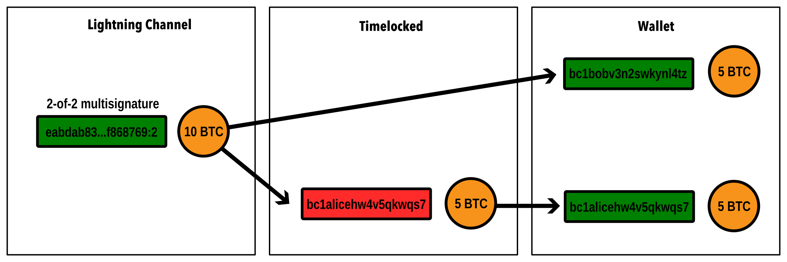
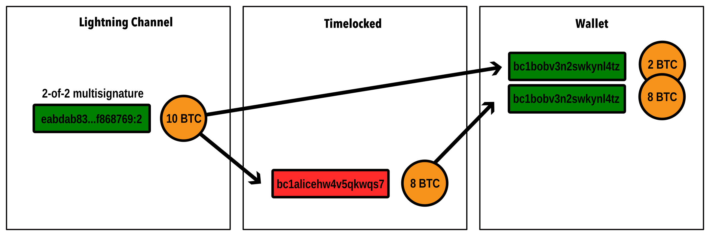

# Watchtowers

In the Lightning Network, peers store a commitment transaction for each update to their channel. The latest commitment transaction can be used to unilaterally close the channel at any time, allowing both parties to regain access to their funds on-chain without consent or participation of the other side. This is called a force close.

## Channel breaches 

To prevent peers from breaching channels, meaning publishing previous, expired and revoked commitment transactions that award them a higher balance then the most previous one, the Lightning Network protocol introduces the concept of a penalty. Whoever publishes a commitment transaction locks up their balance for a predetermined amount of time.

<figure><figcaption>
In a regular unilateral channel closure, Alice, the initiator, has to wait to retrieve her side of the channel, while Bob is able to spend his as soon as the commitment transaction is confirmed.
</figcaption></figure>

For every new channel update, the previous commitment transaction is invalidated by both peers through the exchange of a penalty secret. While the breaching peer has to wait to retrieve their funds, the other node can retrieve their funds immediately and also take the funds of the attacker, as long as they have this secret and are able to produce a valid signature.

<figure><figcaption>
In this case Alice, the initiator, has published a commitment transaction that breaches the channel, meaning a previous, expired channel state. In this case Bob is able to claim her side of the channel right away as a penalty.
</figcaption></figure>

This principle keeps both nodes in check and makes channel breaches extremely rare. But to be able to revoke a breached channel and claim the funds of the attacker as their own, the peer being breached needs to be online regularly and monitor every single transaction in every block for a breach before the arbitration time has elapsed.

## Watchtowers 

To reduce the risk of an attacker successfully breaching one of your channels, we can use watchtowers. Watchtowers are other Lightning Network nodes that ideally run on a separate machine and network from the node they are watching over. They are required to almost always be online and watch every bitcoin block for potential breaches, ideally using their own bitcoin node.

For each commitment transaction of each remote peer, the routing or payment node will preventatively create a signed transaction revoking the channel breach. This transaction is encrypted it with the transaction ID of the breach transaction before passing it onto the watchtower together with the first half of the transaction ID.&#x20;

Using this mechanism, the watchtower knows what transaction IDs to look for, but cannot see the content of each commitment transaction, shielding balances from the watchtower. Only the frequency with which the channel is updated is revealed, and only channel breaches are revealed, not regular force closures, as the revocation key for regular, “honest” unilateral channel closures are not known yet.

Once the watchtower finds a relevant breach it can decrypt the signed revocation transaction and publish it to the bitcoin network. The breach has been prevented, the attacker has forfeited their channel balance as punishment.

## Timelocks

The mechanism that makes this possible is a script that defines two conditions under which the locked up funds can be spent. This “Check Sequence Verify” (CSV) [timelock](../multihop-payments/timelocks.md) measures the number of blocks that passed between the confirmation of the commitment transaction and the current block.

The CSV delay is typically dynamically scaled to the channel size, but can also be manually set. For example, a CSV delay of 144 blocks allows for about 24 hours of time to revoke a channel breach. This means a node or watchtower has to be online and synced at least once every 24h to safely monitor all channel closures.

## Altruism

At the moment, such watchtowers are only implemented as altruistic watchtowers. That means that watchtowers don’t get compensated for successfully intervening in a channel breach. Instead, they run without compensation, or charge for providing their service without guarantee of success.

As such, a node operator who wishes to make use of a watchtower typically runs this watchtower themselves, ideally on a separate machine, network and geolocation than the node they are guarding. One node may make use of multiple watchtowers, and one watchtower may guard multiple nodes.

[Insightful: All unsuccessful channel breaches](https://forkmonitor.info/lightning)

[Learn: How to configure a watchtower](../../lightning-network-tools/lnd/watchtower.md)
