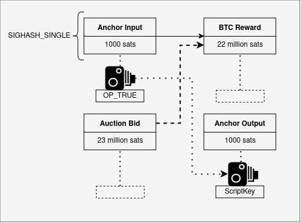

# Taproot Assets Trustless Swap

Atomic swaps are swaps that either complete in full, or reverse back to their initial stage. This removes the need for two swap parties to trust each other, also known as the “first mover problem.”&#x20;

Using Partially Signed Bitcoin Transactions (PSBTs), this swap can be performed in a single onchain transaction using minimal interaction between the swap partners without an external coordinator.

<figure><figcaption>
Diagram of trustless Taproot Assets swap
</figcaption></figure>

The seller of the Taproot Asset creates a PSBT that proves their ownership over the asset while also allowing anybody who fulfills the PSBT to claim ownership over it (OP\_TRUE).

The PSBT defines the Taproot Asset as an input, and the desired BTC amount as an output (22 million sats in the above example). To make the PSBT valid, somebody will need to add an input with at least 22 million sats.

To effectively “buy” the Taproot Asset, they will also include an anchor output for the Taproot Asset and if needed, a change output for their BTC.

As the anchor input cannot be double-spent on the Bitcoin blockchain, only the winner of this auction can claim the Taproot Asset as theirs, while all competing transactions become invalid once a bid is confirmed on the blockchain.
